---
## Front matter
title: "Лабораторная работа №2"
subtitle: "Администрирование сетевых подсистем"
author: "Машков Илья Евгеньевич"

## Generic otions
lang: ru-RU
toc-title: "Содержание"

## Bibliography
bibliography: bib/cite.bib
csl: pandoc/csl/gost-r-7-0-5-2008-numeric.csl

## Pdf output format
toc: true # Table of contents
toc-depth: 2
lof: true # List of figures
lot: true # List of tables
fontsize: 12pt
linestretch: 1.5
papersize: a4
documentclass: scrreprt
## I18n polyglossia
polyglossia-lang:
  name: russian
  options:
	- spelling=modern
	- babelshorthands=true
polyglossia-otherlangs:
  name: english
## I18n babel
babel-lang: russian
babel-otherlangs: english
## Fonts
mainfont: PT Serif
romanfont: PT Serif
sansfont: PT Sans
monofont: PT Mono
mainfontoptions: Ligatures=TeX
romanfontoptions: Ligatures=TeX
sansfontoptions: Ligatures=TeX,Scale=MatchLowercase
monofontoptions: Scale=MatchLowercase,Scale=0.9
## Biblatex
biblatex: true
biblio-style: "gost-numeric"
biblatexoptions:
  - parentracker=true
  - backend=biber
  - hyperref=auto
  - language=auto
  - autolang=other*
  - citestyle=gost-numeric
## Pandoc-crossref LaTeX customization
figureTitle: "Рис."
tableTitle: "Таблица"
listingTitle: "Листинг"
lofTitle: "Список иллюстраций"
lotTitle: "Список таблиц"
lolTitle: "Листинги"
## Misc options
indent: true
header-includes:
  - \usepackage{indentfirst}
  - \usepackage{float} # keep figures where there are in the text
  - \floatplacement{figure}{H} # keep figures where there are in the text
---

# Цель работы

Приобретение практических навыков по установке и конфигурированию DNS-сервера, усвоение принципов работы системы доменных имён.

# Задание

1. Установите на виртуальной машине server DNS-сервер bind и bind-utils.
2. Сконфигурируйте на виртуальной машине server кэширующий DNS-сервер.
3. Сконфигурируйте на виртуальной машине server первичный DNS-сервер.
4. При помощи утилит dig и host проанализируйте работу DNS-сервера.
5. Напишите скрипт для Vagrant, фиксирующий действия по установке и конфигурированию DNS-сервера во внутреннем окружении виртуальной машины server. Соответствующим образом внесите изменения в Vagrantfile.

# Выполнение лабораторной работы

## Установка DNS-сервера

Для начала перехожу в режим суперпользователя, а затем устанавливаю bind и bind-utils (рис. [-@fig:001]).

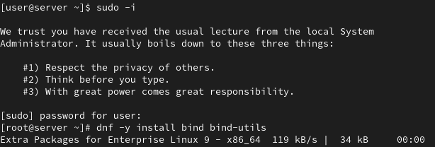{#fig:001 width=70%}

Затем осуществляю запрос к DNS-адресу Яндекса (рис. [-@fig:002]).

{#fig:002 width=70%}

Получаем вывод, который я сейчас поясню по секциям:

- **HEADER** -- показывает версию dig и опции, которые используются с командой;
- **QUESTION SECTION** -- выводит наш запрос (`A` - запрос адреса);
- **ANSWER SECTION** -- 3600 - время жизни запроса и адреса, с которых пришёл ответ;
- В конце нам выводят общую информацию: время выполнения запроса, имя запрашиваемого DNS-сервера, дата и размер сообщения.

## Конфигурирование кэширующего DNS-сервера

### Конфигурирование кэширующего DNS-сервера при отсутствии фильтрации DNS-запросов маршрутизаторами

Затем мы обращаемся к таким конфигурационным файлам, как: resolv.conf (рис. [-@fig:003]), named.conf (рис. [-@fig:004]), named.ca (рис. [-@fig:005]), named.localhost и named.loopback (рис. [-@fig:006]).

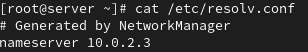{#fig:003 width=70%}

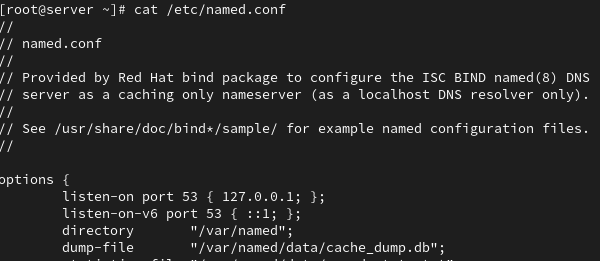{#fig:004 width=70%}

{#fig:005 width=70%}

{#fig:006 width=70%}

И если в выводе (рис. [-@fig:003]), (рис. [-@fig:005]), (рис. [-@fig:006]) мы видим всё то, что видели при обращении к dns-адресу Яндекса, то вывод (рис. [-@fig:004]) стоит рассмотреть более подробно.

**named.conf** является главным конфигурационным файлом для DNS сервера bind и определяет его глобальное поведение и структуру зон. Также файл указывает каталоги (по типу /var/named) для хранения файлов зон и кэша, включает механизмы безопасности **dnssec**, а также определяет или подключает все необходимые зоны (корневую и пользовательскую) дляобработки прямых и обратных DNS-запросов.

-**OPTIONS** - отвечает за настройку кэширующего рекурсивного сервера и разрешаетпринимать запросы от локальной сети, выполнять рекурсию и пересылать неразрешённые запросы вышестоящему серверу.

Затем включаю автозапуск DNS-сервера при запуске системы и запускаю сам сервер. Также произвожу два запроса по адресам Яндеса: первый ровно такой же, что и до этого, а второй - `@127.0.0.1 www.yandex.ru` (рис. [-@fig:007]).

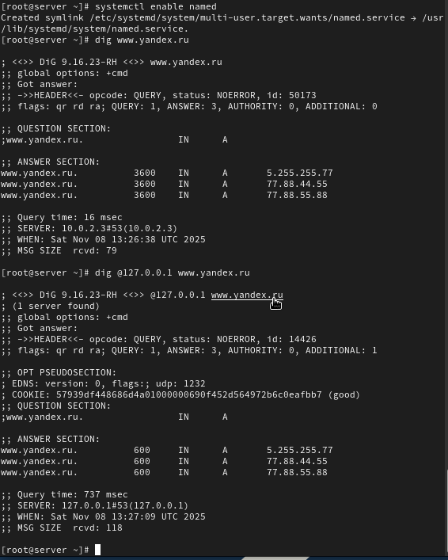{#fig:007 width=70%}

Главное отличие этих запросов состоит в следующем:

- Во втором случае был показан udp, информация о куки;
- Время жизни запроса стало меньше(3600 в первом случае и 600 во втором);
- Время выполнения запроса(16 мсек в первом случае и 737 мсек во втором), имя сервера(127.0.0.1) и размер сообщения(79 в первом случае и 118 во втором) 

Делаю dns-сервер сервером по умолчанию для хоста, для этого меняю адрес на 127.0.0.1(рис. [-@fig:008]).

{#fig:008 width=70%}

Затем перезапускаю NetworkManager и проверяю изменения в файле resolv.conf (рис. [-@fig:009]).

{#fig:009 width=70%}

Настраиваю направление DNS-запросов от всех узлов внутренней сети и запросы узла server через узел server. Делаю я это посредством изменений в файле named.conf (рис. [-@fig:010]).

{#fig:010 width=70%}

Вношу изменения в настройки межсетевого экрана узла server, и тем самым разрешаю ему работу с DNS. А также проверяю, что все запросы идут через заданный узел (рис. [-@fig:011]).

{#fig:011 width=70%}

### Конфигурирование кэширующего DNS-сервера при наличии фильтрации DNS-запросов маршрутизаторами

Добавляю перенаправление DNS-запросов на конкретный вышестоящий сервер посредством изменений в файле named.conf. Если говорить конкретнее, то я добавляю строчки **forwardes и forward first**.(рис. [-@fig:012]).

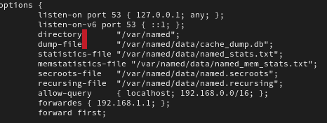{#fig:012 width=70%}

Также указываю настройки, касающиеся технологии DNSSEC. Мы их выключаем, т.к. вышестоящий сервер может их не поддерживать (рис. [-@fig:013]).

{#fig:013 width=70%}

### Конфигурирование первичного DNS-сервера

Копирую шаблон описания DNS-зон в другой каталог и переименовываю его на **user.net** (рис. [-@fig:014]).

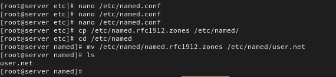{#fig:014 width=70%}

Затем включаю файл описания зоны user.net в файле named.conf (рис. [-@fig:015]).

{#fig:015 width=70%}

В файле user.net меняю зону **localhost.localdomain** на свою прямую зону и вместо зоны **1.0.0.127.in-addr.arpa** прописываю свою обратную зону (рис. [-@fig:016]).

{#fig:016 width=70%}

Затем создаю директории **fz и rz**, в которых будут храниться файлы прямой и обратной зоны (рис. [-@fig:017]).

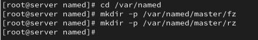{#fig:017 width=70%}

Копирую шаблоны прямой и обратной зоны в соответствующие директории, а также переношу шаблон прямой зоны **named.localhost** и переименовываю его в user.net (рис. [-@fig:018]).

{#fig:018 width=70%}

Затем изменяю файл user.net, указав необходимые dns-записи для прямой зоны и пр. (рис. [-@fig:019]).

{#fig:019 width=70%}

Также изменяю файл шаблон обратной зоны похожим образом, переименовываю его на **"192.168.1"** и переношу в соответствующую директорию (рис. [-@fig:020]).

{#fig:020 width=70%}

Далее меняю права доступа так, чтобы named мог с ними работать (рис. [-@fig:021]).

{#fig:021 width=70%}

Т.к. мы внесли изменения доступа к конфигурационным файлам, нам нужно корректно восстановить метки к файлам named в SELinux. И проверяем их сосотояние (рис. [-@fig:022]).

{#fig:022 width=70%}

Также даю разрешение на запись в файлы dns-зоны (рис. [-@fig:023]).

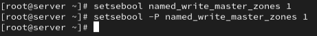{#fig:023 width=70%}

Запускаю расширенный лог системных сообщений в реальном времени, чтобы проверить корректность работы системы (рис. [-@fig:024]).

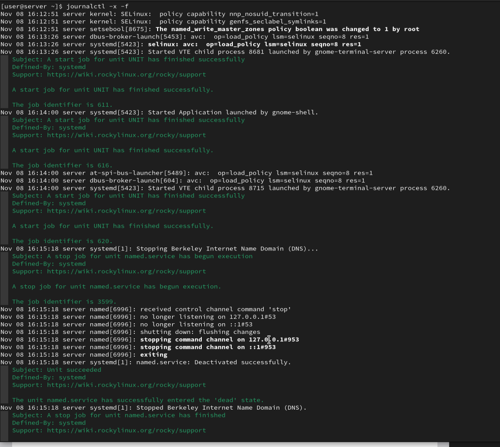{#fig:024 width=70%}

Затем перезапускаю DNS-сервер и смотрю, что в логе не выскочило ни одной ошибки, а значит, что всё работает корректно (рис. [-@fig:025]).

{#fig:025 width=70%}

### Анализ работы DNS-сервера

Отправляю запрос на описание DNS-зоны c сервера ns.user.net (рис. [-@fig:027]).

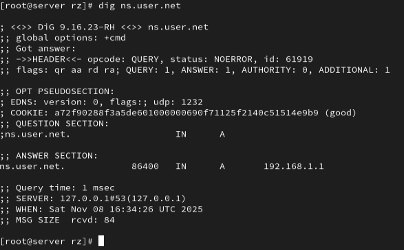{#fig:027 width=70%}

В Выводе видим всё то же самое, что и при запросах к адресам Яндекса. Также мы видим, что обращение приходит на сервер 127.0.0.1, а ответ приходит на 192.168.1.1, что подтверждает корректность всех проделанных действий.

С помощью утилиты host проверяем корректность работы DNS-сервера и видим, что все корректно работает (рис. [-@fig:028]).

{#fig:028 width=70%}

## Внесение изменений в настройки внутреннего окружения виртуальной машины

Создаю каталог **dns** во внутреннем окружении виртуальной машины (рис. [-@fig:029]).

{#fig:029 width=70%}

Создаю скрипт **"dns.sh"**, который будет выполнять все действия выполненные в этой лабораторной работе при запуске системы (рис. [-@fig:030]).

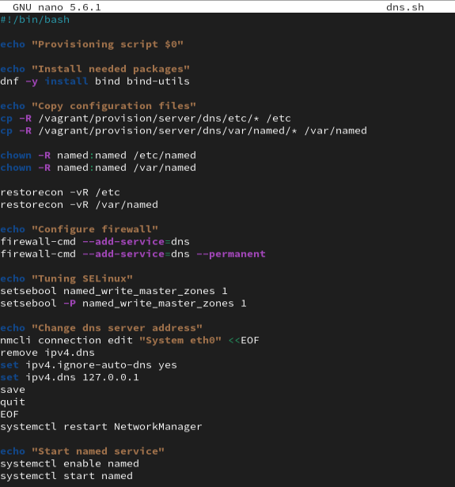{#fig:030 width=70%}

Затем вношу изменения в файл Vagrantfile, чтобы скрипт отрабатывался при каждом запуске системы (рис. [-@fig:031]).

{#fig:031 width=70%}

# Выводы

Во время выполнения данной лабораторной работы я приобрёл практические навыки по установке и конфигурированию DNS-сервера и усвоил принципы работы системы доменных имён.

# Список литературы{.unnumbered}

[Администрирование сетевых подсисем](https://esystem.rudn.ru/pluginfile.php/2854527/mod_resource/content/8/002-dns.pdf)
