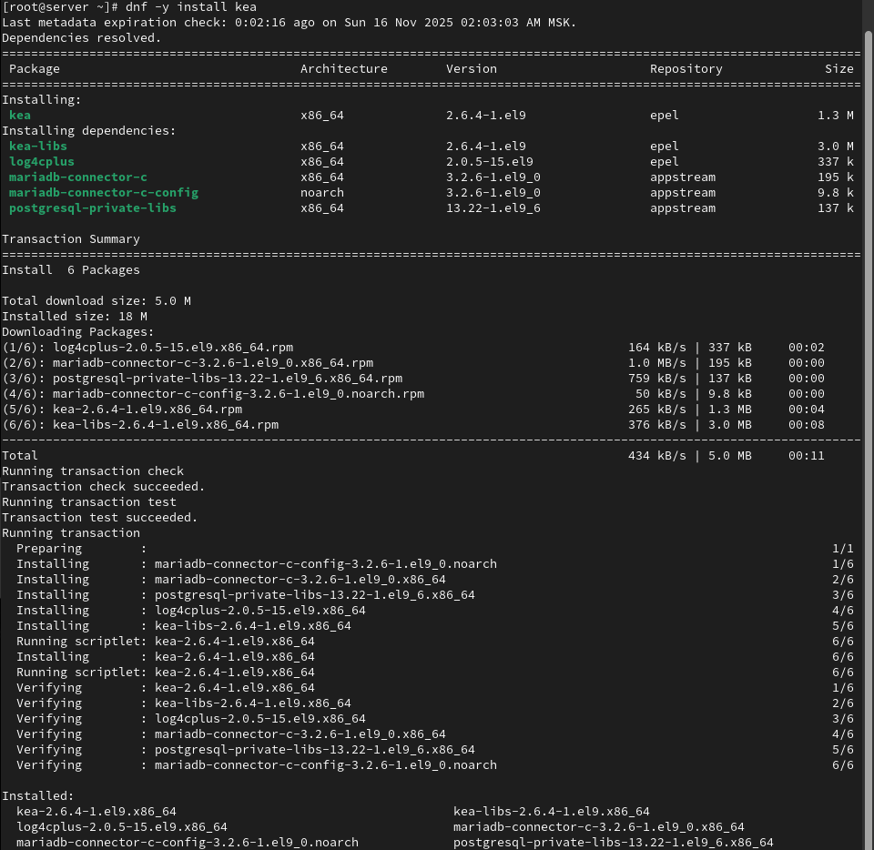
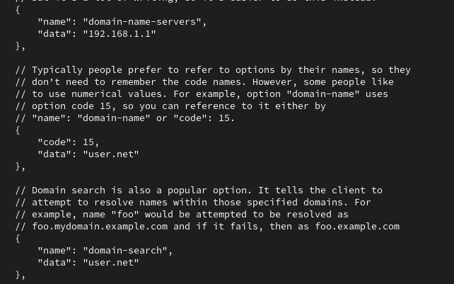
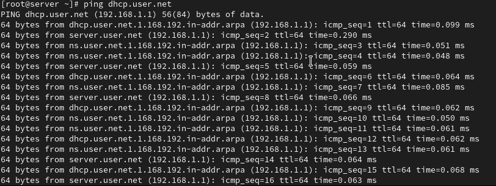
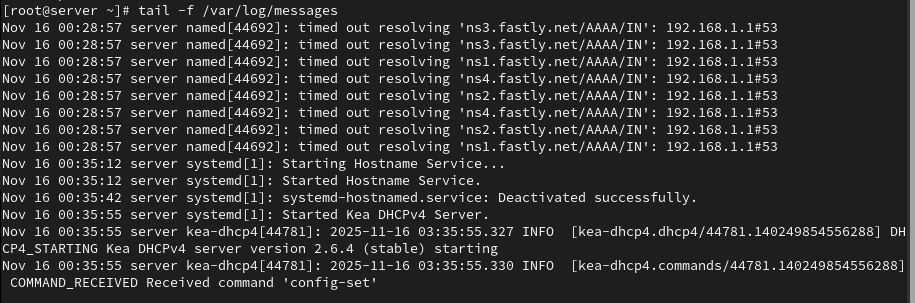
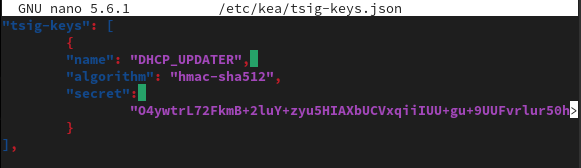
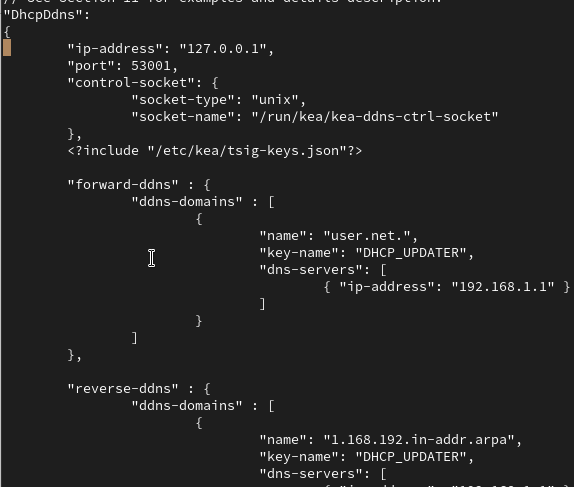

---
## Front matter
lang: ru-RU
title: Администрирование сетевых подсистем
subtitle: Лабораторная работа №3
author:
  - Машков И. Е.
institute:
  - Российский университет дружбы народов, Москва, Россия

date: 10 февраля 2026

## i18n babel
babel-lang: russian
babel-otherlangs: english

## Formatting pdf
toc: false
toc-title: Содержание
slide_level: 2
aspectratio: 169
section-titles: true
theme: metropolis
header-includes:
 - \metroset{progressbar=frametitle,sectionpage=progressbar,numbering=fraction}
---

# Информация

## Докладчик

:::::::::::::: {.columns align=center}
::: {.column width="70%"}

  * Машков Илья Евгеньевич
  * Студент 3-го курса, группа НФИбд-02-23
  * Российский университет дружбы народов
  * [1132231984@pfur.ru](mailto:1132231984@pfur.ru)
  * <https://github.com/7S7eVe7N7>

:::
::: {.column width="30%"}

:::
::::::::::::::

## Цель работы

Приобретение практических навыков по установке и конфигурированию DHCP-сервера.

## Выполнение лабораторной работы

{#fig:001 width=40%}

## Выполнение лабораторной работы

{#fig:003 width=70%}

## Выполнение лабораторной работы

{#fig:004 width=50%}

## Выполнение лабораторной работы

{#fig:005 width=70%}

## Выполнение лабораторной работы

{#fig:011 width=70%}

## Выполнение лабораторной работы

{#fig:014 width=70%}

## Выполнение лабораторной работы

{#fig:020 width=70%}

## Выполнение лабораторной работы

{#fig:023 width=40%}

## Выполнение лабораторной работы

{#fig:026 width=70%}

## Выполнение лабораторной работы

{#fig:028 width=40%}

## Выполнение лабораторной работы

{#fig:032 width=70%}

## Выполнение лабораторной работы

{#fig:036 width=70%}

## Выполнение лабораторной работы

{#fig:039 width=40%}

## Выполнение лабораторной работы

{#fig:040 width=70%}

## Выводы

Во время выполнения лабораторной работы я приобрёл практические навыки по установке и конфигурированию DHCP-сервера.
