---
## Front matter
title: "Лабораторная работа №3"
subtitle: "Администрирование сетевых подсистем"
author: "Машков Илья Евгеньевич"

## Generic otions
lang: ru-RU
toc-title: "Содержание"

## Bibliography
bibliography: bib/cite.bib
csl: pandoc/csl/gost-r-7-0-5-2008-numeric.csl

## Pdf output format
toc: true # Table of contents
toc-depth: 2
lof: true # List of figures
lot: true # List of tables
fontsize: 12pt
linestretch: 1.5
papersize: a4
documentclass: scrreprt
## I18n polyglossia
polyglossia-lang:
  name: russian
  options:
	- spelling=modern
	- babelshorthands=true
polyglossia-otherlangs:
  name: english
## I18n babel
babel-lang: russian
babel-otherlangs: english
## Fonts
mainfont: PT Serif
romanfont: PT Serif
sansfont: PT Sans
monofont: PT Mono
mainfontoptions: Ligatures=TeX
romanfontoptions: Ligatures=TeX
sansfontoptions: Ligatures=TeX,Scale=MatchLowercase
monofontoptions: Scale=MatchLowercase,Scale=0.9
## Biblatex
biblatex: true
biblio-style: "gost-numeric"
biblatexoptions:
  - parentracker=true
  - backend=biber
  - hyperref=auto
  - language=auto
  - autolang=other*
  - citestyle=gost-numeric
## Pandoc-crossref LaTeX customization
figureTitle: "Рис."
tableTitle: "Таблица"
listingTitle: "Листинг"
lofTitle: "Список иллюстраций"
lotTitle: "Список таблиц"
lolTitle: "Листинги"
## Misc options
indent: true
header-includes:
  - \usepackage{indentfirst}
  - \usepackage{float} # keep figures where there are in the text
  - \floatplacement{figure}{H} # keep figures where there are in the text
---

# Цель работы

Приобретение практических навыков по установке и конфигурированию DHCP-сервера.

# Задание

1. Установите на виртуальной машине server DHCP-сервер.
2. Настройте виртуальную машину server в качестве DHCP-сервера для виртуальной внутренней сети.
3. Проверьте корректность работы DHCP-сервера в виртуальной внутренней сети путём запуска виртуальной машины client и применения соответствующих утилит диагностики.
4. Настройте обновление DNS-зоны при появлении в виртуальной внутренней сети новых узлов.
5. Проверьте корректность работы DHCP-сервера и обновления DNS-зоны в виртуальной внутренней сети путём запуска виртуальной машины client и применения соответствующих утилит диагностики.
6. Напишите скрипт для Vagrant, фиксирующий действия по установке и настройке DHCP-сервера во внутреннем окружении виртуальной машины server. Соответствующим образом внести изменения в Vagrantfile.

# Выполнение лабораторной работы

## Установка DHCP-сервера

Произвожу установку dhcp (рис. [-@fig:001]).

{#fig:001 width=70%}

## Конфигурирование DHCP-сервера

На всякий случай сохраняю изначальную версию конфиговского файла (рис. [-@fig:002]).

{#fig:002 width=70%}

Затем открываю **"kea-dhcp4.conf"** и меняю в нём шаблон **"domain-name"** (рис. [-@fig:003]).

{#fig:003 width=70%}

Затем создаю собственную конфигурацию dhcp-сети, используя примеры, предоставленные в самом файле. Задаю адрес подсети, диапазон адресов для распределения клиентам, адрес маршрутизатора и broadcast-адрес (рис. [-@fig:004]).

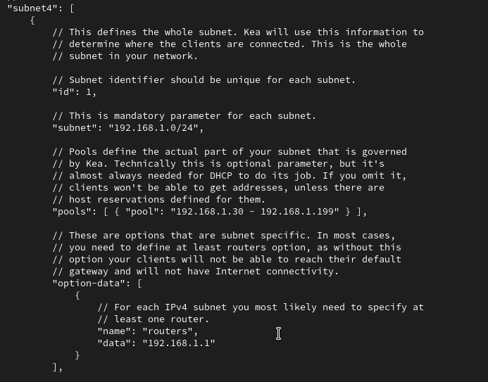{#fig:004 width=70%}

Настраиваю привязку dhcpd к интерфейсу eth1 машины server (рис. [-@fig:005]).

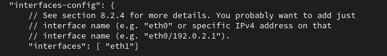{#fig:005 width=70%}

Проверяю правильность проделанных действий (рис. [-@fig:006]).

{#fig:006 width=70%}

Перезагружаю конфигурацию dhcpd и разрешаю загрузку dhcp-сервера при запуске системы (рис. [-@fig:007]).

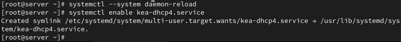{#fig:007 width=70%}

Добавляю А запись в конец файла прямой зоны и PTR запись в конце файла обратной зоны (рис. [-@fig:008]), (рис. [-@fig:009]).

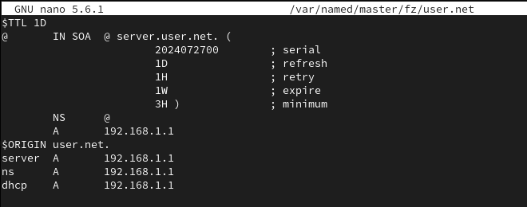{#fig:008 width=70%}

{#fig:009 width=70%}

Перезапускаю named (рис. [-@fig:010]).

{#fig:010 width=70%}

Обращаюсь к dhcp-серверу по имени и получаю ответ (рис. [-@fig:011]).

{#fig:011 width=70%}

Вношу изменения в настройки межсетевого экрана узла server, тем самым разрешая работу с dhcp (рис. [-@fig:012]).

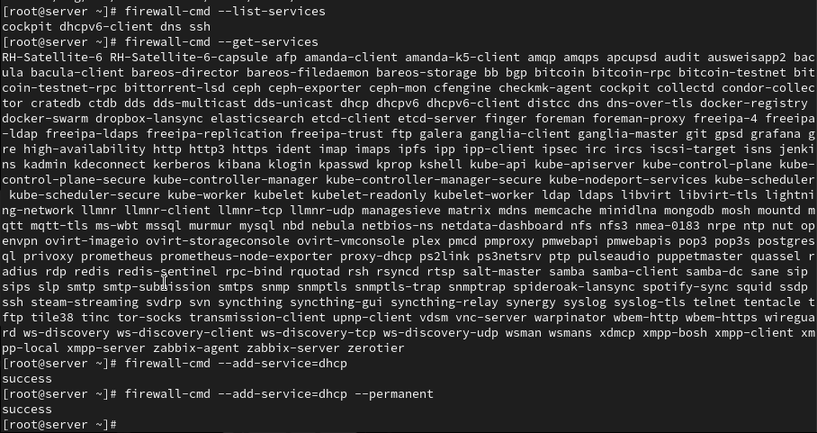{#fig:012 width=70%}

Восстанавливаю контекст безопасности SELinux (рис. [-@fig:013]).

{#fig:013 width=70%}

В дополнительном окне терминала запускаю мониторинг происходящих в системе процессов, а в основном запускаю dhcp-сервер(Это я не скринил). Как мы видим запуск прошёл успешно (рис. [-@fig:014]).

{#fig:014 width=70%}

## Анализ работы DHCP-сервера

Создаю скрипт **"01-routing.sh"** для того, чтобы весь трафик на client шёл через eth1 (рис. [-@fig:015]).

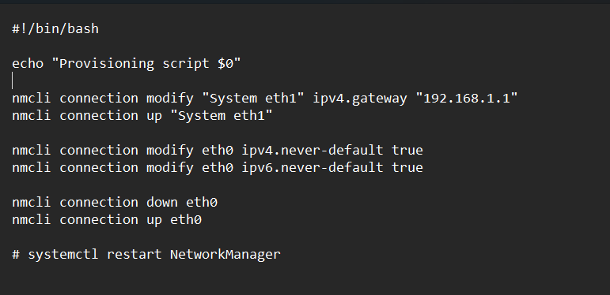{#fig:015 width=70%}

Также автоматизирую этот процесс, внося изменения в Vagrantfile для того, чтобы скрипт запускался при каждом запуске машины client (рис. [-@fig:016]).

{#fig:016 width=70%}

После загрузки машины client в файле **"kea-leases4.csv"** появились записи, сведетельствующие о том, что трафик идет по тому интерфейсу, по которому было задумано (рис. [-@fig:017]).

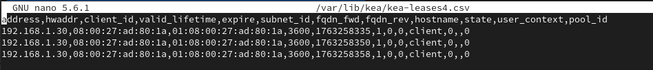{#fig:017 width=70%}

Далее вывожу информацию об имеющихся интерфейсах на клиенте и получаю всю информацию о eth0 и eth1 (рис. [-@fig:018]).

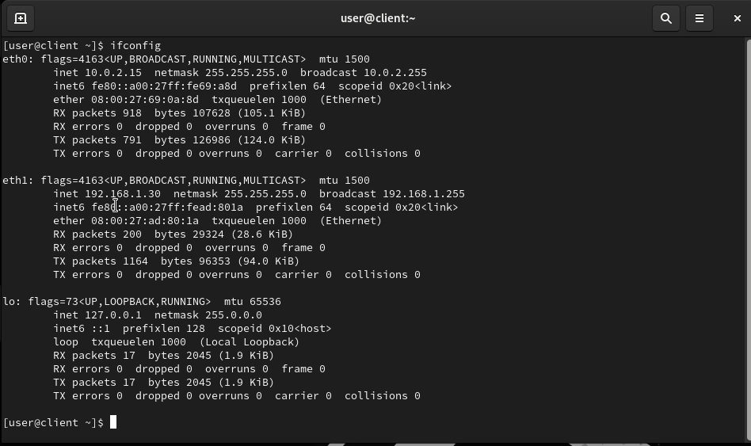{#fig:018 width=70%}

- **eth0** -- основной интерфейс, который находится в активном статусе, он запущен и поддерживает broadcast и multicast. Также мы имеем его адрес(10.0.2.15);

- **eth1** -- доп. сетевой инерфейс с теми же характеристиками, но другим адресом(192.168.1.30);

- **lo** -- виртуальный интерфейс обратной связи, использующийся для внутренней связи в системе.

## Настройка обновления DNS-зоны

Создаю ключ на сервере Bind9 машины server (рис. [-@fig:020]).

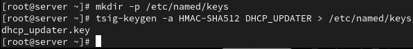{#fig:020 width=70%}

Просматриваю файл dhcp_updater.key (рис. [-@fig:021]).

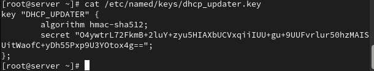{#fig:021 width=70%}

Меняю права доступа (рис. [-@fig:022]).

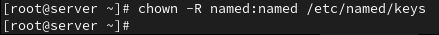{#fig:022 width=70%}

В конце файла named.conf добавляю строку для подключения ключа (рис. [-@fig:023]).

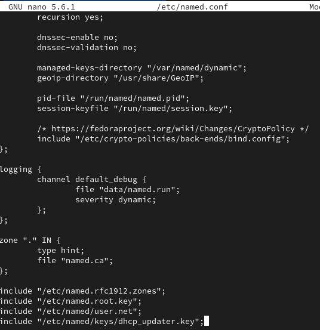{#fig:023 width=70%}

В файле user.net вношу изменения, позволяющие зоне обновляться (рис. [-@fig:024]).

{#fig:024 width=70%}

Произвожу проверку конфиговского файла и перезапускаю DNS-сервер (рис. [-@fig:025]).

{#fig:025 width=70%}

Формирую ключ для Kea. Для этого создаю файл **"tsig-keys.json"** и переношу туда ранее созданный ключ (рис. [-@fig:026]).

{#fig:026 width=70%}

Сменяю владельна и поправляю права доступа (рис. [-@fig:027]).

{#fig:027 width=70%}

Далее настройка будет производится в файле **"kea-dhcp-ddns.conf"** (рис. [-@fig:028]).

{#fig:028 width=70%}

Меняю владельца файла и проверяю файл на наличие синтаксическик ошибок(их не обнаружилось) и запускаю службу ddns (рис. [-@fig:030]).

{#fig:030 width=70%}

Проверяю статус работы службы (рис. [-@fig:031]).

{#fig:031 width=70%}

Вношу изменения в файл kea-dhcp4.conf, тем самым добавляя разрешение на динамическое обновление dns-записей с локального узла прямой и обратной зон (рис. [-@fig:032]).

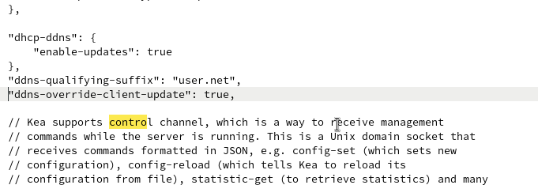{#fig:032 width=70%}

Проверяю файл на наличие синтаксических ошибок (рис. [-@fig:033]).

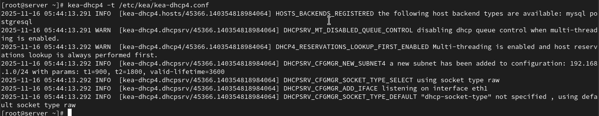{#fig:033 width=70%}

Затем перезапускаю dhcp-сервер и проверяю его статус (рис. [-@fig:034]).

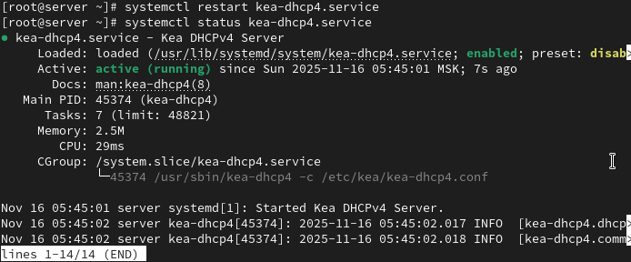{#fig:034 width=70%}

На машине client переполучаю адрес (рис. [-@fig:035]).

{#fig:035 width=70%}

## Анализ работы DHCP-сервера после настройки обновления DNS-зоны

Обращаюсь к client.user.net, получаю ответ похожий на те, что были в прошлой лабе (рис. [-@fig:036]).

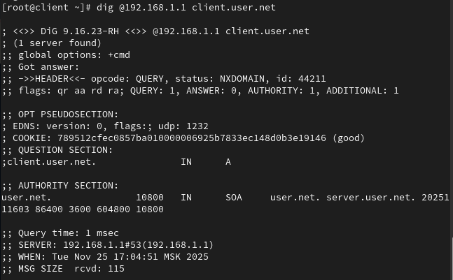{#fig:036 width=70%}

Видим, что запрос ушёл на server, а вернулся на тот самый адрес(192.168.1.1), который мы и ставили выше.

## Внесение изменений в настройки внутреннего окружения виртуальной машины

Вношу изменения в настройки внутреннего окружения машины server, внося туда конфигурационные файлы dhcp (рис. [-@fig:037]).

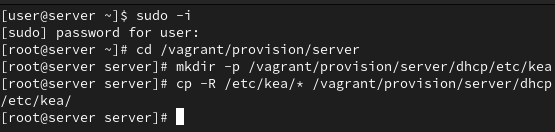{#fig:037 width=70%}

Таже заменяю конфигурационные файлы dns-сервера (рис. [-@fig:038]).

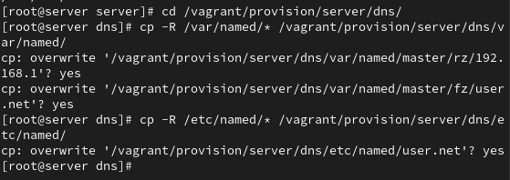{#fig:038 width=70%}

В каталоге vagrant/provision/server создаю скрипт dhcp.sh (рис. [-@fig:039]).

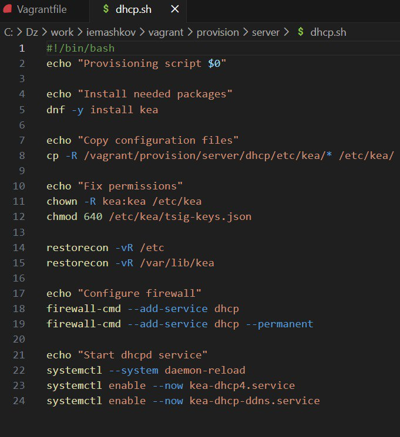{#fig:039 width=70%}

Настройка автоматизации отработки этого скрипта при запуске машины server производится путём внесения изменений в файл Vagrantfile (рис. [-@fig:040]).

{#fig:040 width=70%}

# Выводы

Во время выполнения лабораторной работы я приобрёл практические навыки по установке и конфигурированию DHCP-сервера.

# Список литературы{.unnumbered}

[Администрирование сетевых подсисем](https://esystem.rudn.ru/pluginfile.php/2854533/mod_resource/content/8/003-dhcp.pdf)
