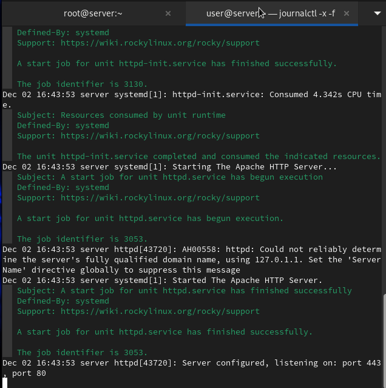
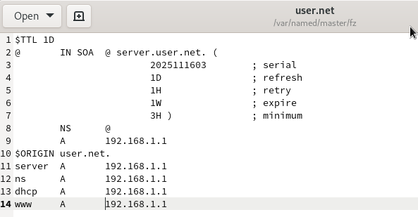
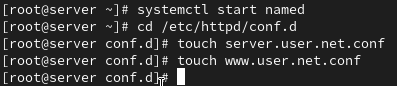
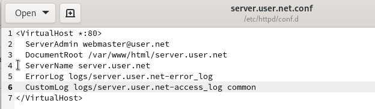
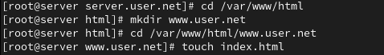
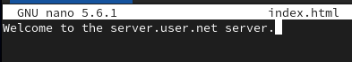
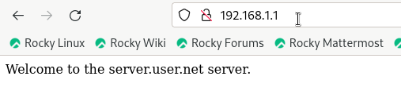
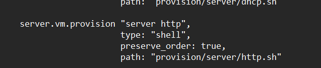

---
## Front matter
title: "Лабораторная работа №4"
subtitle: "Администрирование сетевых подсистем"
author: "Машков Илья Евгеньевич"

## Generic otions
lang: ru-RU
toc-title: "Содержание"

## Bibliography
bibliography: bib/cite.bib
csl: pandoc/csl/gost-r-7-0-5-2008-numeric.csl

## Pdf output format
toc: true # Table of contents
toc-depth: 2
lof: true # List of figures
lot: true # List of tables
fontsize: 12pt
linestretch: 1.5
papersize: a4
documentclass: scrreprt
## I18n polyglossia
polyglossia-lang:
  name: russian
  options:
	- spelling=modern
	- babelshorthands=true
polyglossia-otherlangs:
  name: english
## I18n babel
babel-lang: russian
babel-otherlangs: english
## Fonts
mainfont: PT Serif
romanfont: PT Serif
sansfont: PT Sans
monofont: PT Mono
mainfontoptions: Ligatures=TeX
romanfontoptions: Ligatures=TeX
sansfontoptions: Ligatures=TeX,Scale=MatchLowercase
monofontoptions: Scale=MatchLowercase,Scale=0.9
## Biblatex
biblatex: true
biblio-style: "gost-numeric"
biblatexoptions:
  - parentracker=true
  - backend=biber
  - hyperref=auto
  - language=auto
  - autolang=other*
  - citestyle=gost-numeric
## Pandoc-crossref LaTeX customization
figureTitle: "Рис."
tableTitle: "Таблица"
listingTitle: "Листинг"
lofTitle: "Список иллюстраций"
lotTitle: "Список таблиц"
lolTitle: "Листинги"
## Misc options
indent: true
header-includes:
  - \usepackage{indentfirst}
  - \usepackage{float} # keep figures where there are in the text
  - \floatplacement{figure}{H} # keep figures where there are in the text
---

# Цель работы

Приобретение практических навыков по установке и базовому конфигурированию HTTP-сервера Apache.

# Задание

1. Установите необходимые для работы HTTP-сервера пакеты.
2. Запустите HTTP-сервер с базовой конфигурацией и проанализируйте его работу.
3. Настройте виртуальный хостинг.
4. Напишите скрипт для Vagrant, фиксирующий действия по установке и настройке HTTP-сервера во внутреннем окружении виртуальной машины server. Соответствующим образом внесите изменения в Vagrantfile.

# Выполнение лабораторной работы

## Установка HTTP-сервера

Устанавливаю Http-сервер, утилиты httpd, криптоутилиты и пр. (рис. [-@fig:001]), (рис. [-@fig:002]).

{#fig:001 width=70%}

{#fig:002 width=70%}

## Базовое конфигурирование HTTP-сервера

Вношу изменения в межсетевой экран узла server, тем самым разрешив работу с http (рис. [-@fig:011]).

{#fig:011 width=70%}

Во втором окне запустил расширенный лог системных сообщений в реальном времени (рис. [-@fig:012]).

{#fig:012 width=70%}

В первом окне активирую и запускаю HTTP-сервер (рис. [-@fig:013]).

{#fig:013 width=70%}

## Анализ работы HTTP-сервера

По логу вижу, что ошибок нет (рис. [-@fig:014]).

{#fig:014 width=70%}

И ещё запускаю лог доступа к серверу (рис. [-@fig:015]).

{#fig:015 width=70%}

В логе вижу, что было несколько обращений по адресу **"192.168.1.1"** через браузер FireFox

## Настройка виртуального хостинга для HTTP-сервера

Останавливаю работу dns-сервера и добавляю запись для HTTP-сервера в файл прямой зоны(рис. [-@fig:016]).

{#fig:016 width=70%}

То же делаю и в файл обратной зоны (рис. [-@fig:017]).

{#fig:017 width=70%}

Перезапускаю DNS-сервер и создаю два файла: **"server.user.net.conf"** и **"www.user.net.conf"** (рис. [-@fig:018]).

{#fig:018 width=70%}

Редактирую файл **"server.user.net.conf"** и вношу туда информацию, которая отображена на скриншоте (рис. [-@fig:019]).

{#fig:019 width=70%}

В файл **"www.user.net.conf"** тоже вношу изменения (рис. [-@fig:020]).

{#fig:020 width=70%}

Затем создаю тестовые страницы для виртуальных веб-серверов **"server.user.net"** и **"www.user.net"** (рис. [-@fig:021]), (рис. [-@fig:023]).

{#fig:021 width=70%}

{#fig:023 width=70%}

В этот самый **"index.html"** вношу запись, которая должна будет отображаться при открытии этого сервера в браузере (рис. [-@fig:022]), (рис. [-@fig:024]).

{#fig:022 width=70%}

{#fig:024 width=70%}

Корректирую права доступа каталога с веб-контентом (рис. [-@fig:025]).

{#fig:025 width=70%}

Восстанавливаю контекст безопасности в SELinux (рис. [-@fig:026]).

{#fig:026 width=70%}

Перезапускаю HTTP-сервер и перехожу по адресу 192.168.1.1 и вижу запись для server.user.net (рис. [-@fig:027]).

{#fig:027 width=70%}

## Внесение изменений в настройки внутреннего окружения виртуальной машины

Перехожу в каталог, чтобы произвести изменения настроек внутреннего окружения машины server. А именно мы копируем конфиговские файлы http в соответствующие подкаталоги (рис. [-@fig:028]).

{#fig:028 width=70%}

Затем перезаписываю конфиговские файлы DNS-сервера (рис. [-@fig:029]).

{#fig:029 width=70%}

Прописываю скрипт http.sh, который будет повторять всё то, что я делал ранее при запуске машины server (рис. [-@fig:030]).

{#fig:030 width=70%}

Для отработки данного скрипта вношу изменения в файл Vagrantfile (рис. [-@fig:031]).

{#fig:031 width=70%}

# Выводы

В процессе выполнения данной лабораторной работы я освоил установку и базовое конфигурирование HTTP-сервера Apache

# Список литературы{.unnumbered}

[Администрирование сетевых подсисем](https://esystem.rudn.ru/pluginfile.php/2854539/mod_resource/content/6/004-http.pdf)
