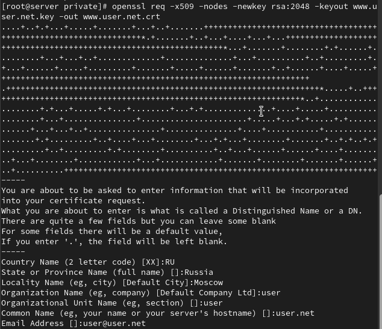
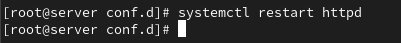
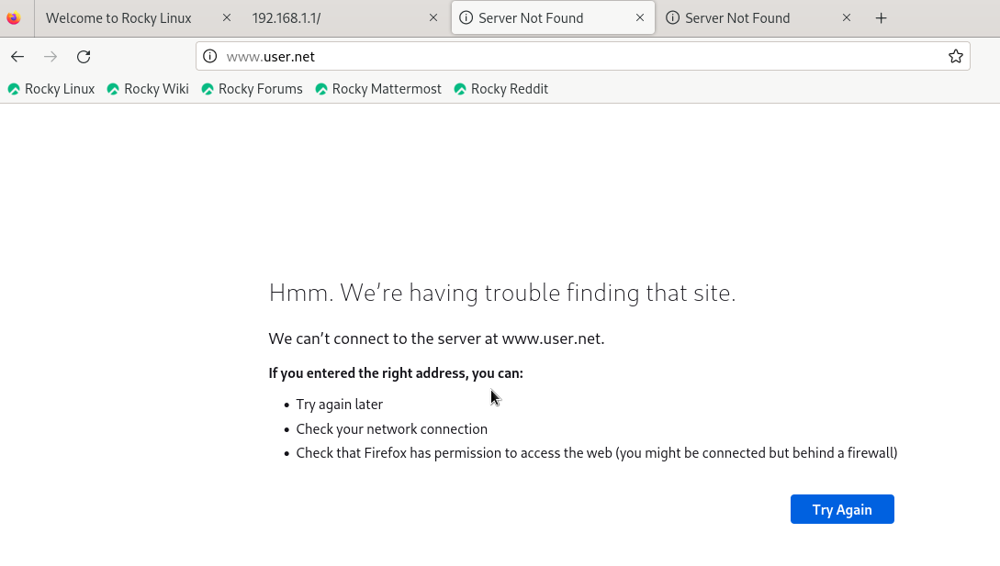
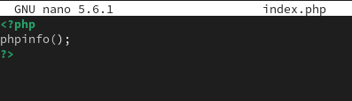

---
## Front matter
title: "Лабораторная работа №5"
subtitle: "Администрирование сетевых подсистем"
author: "Машков Илья Евгеньевич"

## Generic otions
lang: ru-RU
toc-title: "Содержание"

## Bibliography
bibliography: bib/cite.bib
csl: pandoc/csl/gost-r-7-0-5-2008-numeric.csl

## Pdf output format
toc: true # Table of contents
toc-depth: 2
lof: true # List of figures
lot: true # List of tables
fontsize: 12pt
linestretch: 1.5
papersize: a4
documentclass: scrreprt
## I18n polyglossia
polyglossia-lang:
  name: russian
  options:
	- spelling=modern
	- babelshorthands=true
polyglossia-otherlangs:
  name: english
## I18n babel
babel-lang: russian
babel-otherlangs: english
## Fonts
mainfont: PT Serif
romanfont: PT Serif
sansfont: PT Sans
monofont: PT Mono
mainfontoptions: Ligatures=TeX
romanfontoptions: Ligatures=TeX
sansfontoptions: Ligatures=TeX,Scale=MatchLowercase
monofontoptions: Scale=MatchLowercase,Scale=0.9
## Biblatex
biblatex: true
biblio-style: "gost-numeric"
biblatexoptions:
  - parentracker=true
  - backend=biber
  - hyperref=auto
  - language=auto
  - autolang=other*
  - citestyle=gost-numeric
## Pandoc-crossref LaTeX customization
figureTitle: "Рис."
tableTitle: "Таблица"
listingTitle: "Листинг"
lofTitle: "Список иллюстраций"
lotTitle: "Список таблиц"
lolTitle: "Листинги"
## Misc options
indent: true
header-includes:
  - \usepackage{indentfirst}
  - \usepackage{float} # keep figures where there are in the text
  - \floatplacement{figure}{H} # keep figures where there are in the text
---

# Цель работы

Приобретение практических навыков по расширенному конфигурированию HTTP-сервера Apache в части безопасности и возможности использования PHP.

# Задание

1. Сгенерируйте криптографический ключ и самоподписанный сертификат безопасности для возможности перехода веб-сервера от работы через протокол HTTP к работе через протокол HTTPS.
2. Настройте веб-сервер для работы с PHP.
3. Напишите (или скорректируйте) скрипт для Vagrant, фиксирующий действия по расширенной настройке HTTP-сервера во внутреннем окружении виртуальной машины server.

# Выполнение лабораторной работы

## Конфигурирование HTTP-сервера для работы через протокол HTTPS

Создаю каталог private, а затем произвожу генерацию ключа и сертификата безопасности (рис. [-@fig:001]).

{#fig:001 width=70%}

В диалоговом окне заполняю всё следующим образом:
- в строке кода страны укажите RU;
- в строке названия страны укажите Russia;
- в строке названия города укажите Moscow;
- в строке названия организации укажите свой логин;
- в строке названия подразделения укажите свой логин;
- в строке названия хоста должно быть указано доменное имя вашего веб-сервера user.net;
- в строке e-mail адреса должен быть указан user@user.net. 

Затем копирую сертификат в каталог /etc/ssl/certs (рис. [-@fig:002]).

{#fig:002 width=70%}

Затем в конфигурационный файл www.user.net.conf(доменное имя которого у меня не работал ещё в прошлой лабе) вношу строки, которые позволяют активировать протокол HTTPS, т.к. без сертификата безопасноти этого сделать не получится. По сути в этих строках мы предоставляем ключ и сертификат безопасноти для активации нужного нам протокола (рис. [-@fig:003]).

{#fig:003 width=70%}

Вношу изменения в межсетевой экран, тем самым разрешая работу с https (рис. [-@fig:004]).

{#fig:004 width=70%}

Перезапускаю HTTP-сервер (рис. [-@fig:005]).

{#fig:005 width=70%}

Т.к. и в прошлой лабе этот адрес у меня не работал, то и в этой лабе, ожидаемо, он тоже работать не будет, но в url мы должны были увидеть, что мы используем протокол HTTPS (рис. [-@fig:006]).

{#fig:006 width=70%}

## Конфигурирование HTTP-сервера для работы с PHP

Устанавливаю пакеты для PHP (рис. [-@fig:007]).

{#fig:007 width=70%}

В каталоге www.user.net меняю файл index.html на index.php (рис. [-@fig:008]).

{#fig:008 width=70%}

Затем корректирую права доступа, восстанавливаю контекст безопасности и перезапускаю http-сервер (рис. [-@fig:009]).

{#fig:009 width=70%}

Т.к. оно не работало и до этого, то и здесь оно тоже не работает, а должно было вывести информация об используемой на этом веб-сервере версии PHP (рис. [-@fig:010]).

{#fig:010 width=70%}

## Внесение изменений в настройки внутреннего окружения виртуальной машины

Вношу изменения в настройки внутреннего окружения машины server путём добавления конфигурационных файлов, которые мы создали или изменяли за время выполнения этой лабораторной (рис. [-@fig:011]).

{#fig:011 width=70%}

Т.к. мы ничего глобального здесь не сделали, то нам всего лишь надо добавить установку PHP и настройку межсетевого экрана, позволяющую работать с https в скрипт http.sh (рис. [-@fig:012]).

{#fig:012 width=70%}

# Выводы

В процессе выполнения данной лабораторной работы я освоил практичесие навыки по расширенному конфигурированию HTTP-сервера Apache в части безопасности и возможности использования PHP.

# Список литературы{.unnumbered}

[Администрирование сетевых подсисем](https://esystem.rudn.ru/pluginfile.php/2854543/mod_resource/content/8/005-http-adv.pdf)
