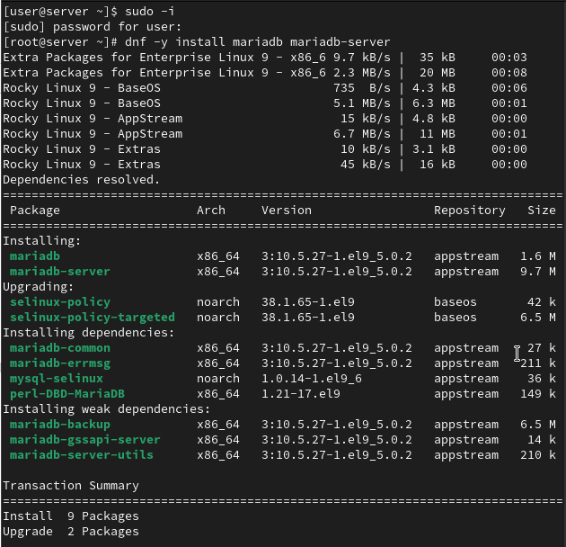
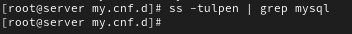
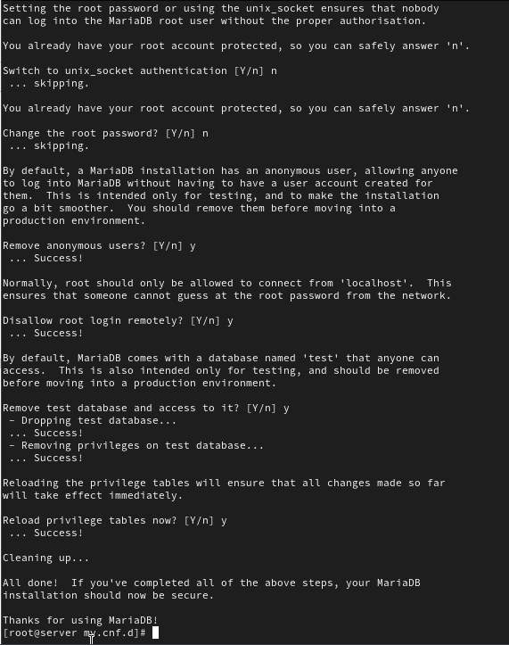
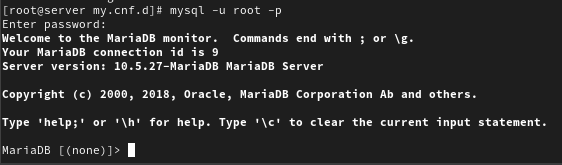
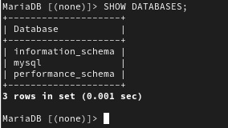
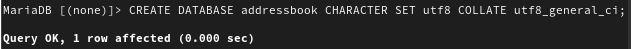
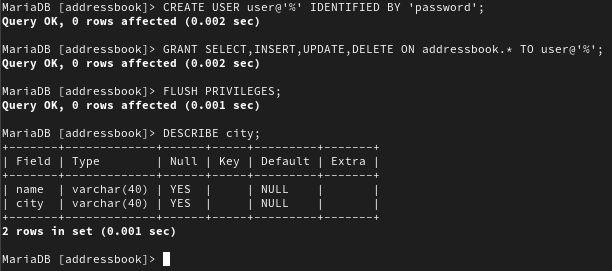
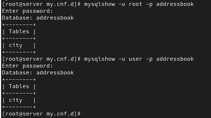
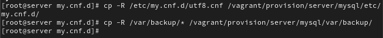

---
## Front matter
title: "Лабораторная работа №6"
subtitle: "Администрирование сетевых подсистем"
author: "Машков Илья Евгеньевич"

## Generic otions
lang: ru-RU
toc-title: "Содержание"

## Bibliography
bibliography: bib/cite.bib
csl: pandoc/csl/gost-r-7-0-5-2008-numeric.csl

## Pdf output format
toc: true # Table of contents
toc-depth: 2
lof: true # List of figures
lot: true # List of tables
fontsize: 12pt
linestretch: 1.5
papersize: a4
documentclass: scrreprt
## I18n polyglossia
polyglossia-lang:
  name: russian
  options:
	- spelling=modern
	- babelshorthands=true
polyglossia-otherlangs:
  name: english
## I18n babel
babel-lang: russian
babel-otherlangs: english
## Fonts
mainfont: PT Serif
romanfont: PT Serif
sansfont: PT Sans
monofont: PT Mono
mainfontoptions: Ligatures=TeX
romanfontoptions: Ligatures=TeX
sansfontoptions: Ligatures=TeX,Scale=MatchLowercase
monofontoptions: Scale=MatchLowercase,Scale=0.9
## Biblatex
biblatex: true
biblio-style: "gost-numeric"
biblatexoptions:
  - parentracker=true
  - backend=biber
  - hyperref=auto
  - language=auto
  - autolang=other*
  - citestyle=gost-numeric
## Pandoc-crossref LaTeX customization
figureTitle: "Рис."
tableTitle: "Таблица"
listingTitle: "Листинг"
lofTitle: "Список иллюстраций"
lotTitle: "Список таблиц"
lolTitle: "Листинги"
## Misc options
indent: true
header-includes:
  - \usepackage{indentfirst}
  - \usepackage{float} # keep figures where there are in the text
  - \floatplacement{figure}{H} # keep figures where there are in the text
---

# Цель работы

Приобретение практических навыков по установке и конфигурированию системы управления базами данных на примере программного обеспечения MariaDB.

# Задание

1. Установите необходимые для работы MariaDB пакеты.
2. Настройте в качестве кодировки символов по умолчанию utf8 в базах данных.
3. В базе данных MariaDB создайте тестовую базу addressbook, содержащую таблицу city с полями name и city, т.е., например, для некоторого сотрудника указан город, в котором он работает.
4. Создайте резервную копию базы данных addressbook и восстановите из неё данные.
5. Напишите скрипт для Vagrant, фиксирующий действия по установке и настройке базы данных MariaDB во внутреннем окружении виртуальной машины server. Соответствующим образом следует внести изменения в Vagrantfile.

# Выполнение лабораторной работы

## Установка MariaDB

Устанавливаю необходимые пакеты для работы с MariaDB (рис. [-@fig:001]).

{#fig:001 width=70%}

Запускаю и включаю mariadb (рис. [-@fig:009]).

{#fig:009 width=70%}

Затем убеждаюсь в том, что mariadb прослушивает порт 3306, но на скриншоте этого нет, т.к. это первая его версия, после парочки изменений всё заработало (рис. [-@fig:010]).

{#fig:010 width=70%}

Запускаю скрипт конфигурации безопасности mariadb (рис. [-@fig:011]).

{#fig:011 width=70%}

В диалоговом окне было выбрано следующее: устанавливаю пароль для пользователя root базы данных, отключаю удалённый корневой доступ и удаляю тестовую базу данных и любых анонимных пользователей.

Запускаю базу данных с правами администратора (рис. [-@fig:012]).

{#fig:012 width=70%}

Просматриваю список команд(рис. [-@fig:013]).

{#fig:013 width=70%}

Затем просматриваю все доступные базы данных (рис. [-@fig:014]).

{#fig:014 width=70%}

На тот момент мне были доступны три базы данных: information_schema, mysql, performance_schema.

## Создание базы данных

Создаю БД с именем addressbook (рис. [-@fig:015]).

{#fig:015 width=70%}

Перехожу к нашей БД и отображаю таблицы, которых там, ожидаемо, нет(рис. [-@fig:016]).

{#fig:016 width=70%}

Создаю таблицу с названием **"city"** и заполняю строки **"name"**(Иванов, Петров, Сидоров) и **"city"**(Москва, Сочи, Дубна). Затем обращаюсь к таблице через "*", что означает вывод всей информации (рис. [-@fig:017]).

{#fig:017 width=70%}

Затем создаю пользователя для работы с БД, задаю ему пароль, предоставляю права доступа для пользователя и обновляю привелегии, а также просматриваю общую информацию о ней и выхожу (рис. [-@fig:018]).

{#fig:018 width=70%}

Просматриваю список всех БД, где вижу созданную мной БД addressbook(рис. [-@fig:019]).

{#fig:019 width=70%}

Просматриваю список таблиц в addressbook двумя способами (рис. [-@fig:020]).

{#fig:020 width=70%}

## Резервные копии

Создаю каталог для хранения резервных копий, делаю резервную копию addressbook, сжатую резервную копию, восстанавливаю БД из резервной копии и из сжатой резервной копии (рис. [-@fig:021]).

{#fig:021 width=70%}

## Внесение изменений в настройки внутреннего окружения виртуальной машины

Создаю поддиректории в каталоге внутреннего окружения машины server для хранения конфигурационных файлов mariadb и резервных копий (рис. [-@fig:022]).

{#fig:022 width=70%}

Копирую конфигурационные файлы и резервные копии в соответствующие директории (рис. [-@fig:023]).

{#fig:023 width=70%}

Создаю скрипт mysql.sh, который будет воспроизводить все проделанные мной действия (рис. [-@fig:024]).

{#fig:024 width=70%}

Для отработки скрипта добавляю соответствующую запись в Vagrantfile (рис. [-@fig:025]).

{#fig:025 width=70%}

# Выводы

В процессе выполнения лабораторной работы я получил практические навыки по установке и конфигурированию системы управления базами данных на примере программного обеспечения MariaDB.

# Список литературы{.unnumbered}

[Администрирование сетевых подсисем](https://esystem.rudn.ru/pluginfile.php/2854547/mod_resource/content/6/006-mysql.pdf)
