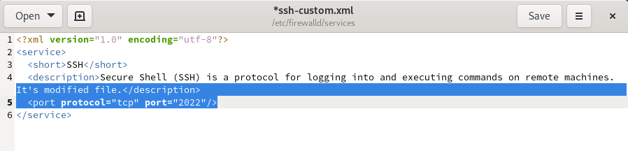
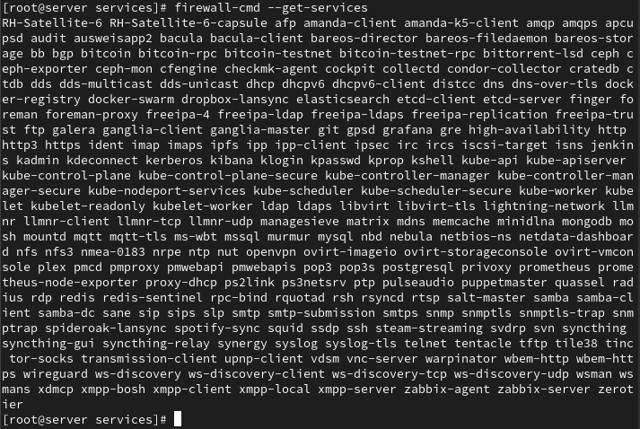
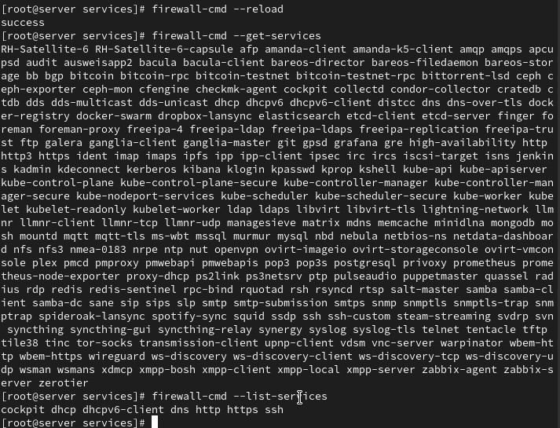
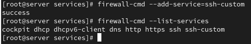
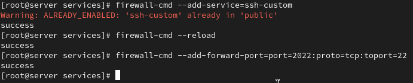
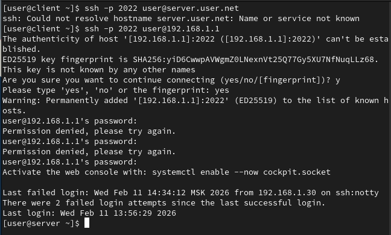
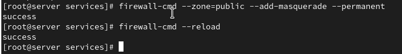
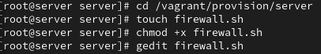
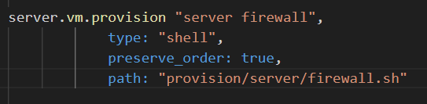

---
## Front matter
title: "Лабораторная работа №7"
subtitle: "Администрирование сетевых подсистем"
author: "Машков Илья Евгеньевич"

## Generic otions
lang: ru-RU
toc-title: "Содержание"

## Bibliography
bibliography: bib/cite.bib
csl: pandoc/csl/gost-r-7-0-5-2008-numeric.csl

## Pdf output format
toc: true # Table of contents
toc-depth: 2
lof: true # List of figures
lot: true # List of tables
fontsize: 12pt
linestretch: 1.5
papersize: a4
documentclass: scrreprt
## I18n polyglossia
polyglossia-lang:
  name: russian
  options:
	- spelling=modern
	- babelshorthands=true
polyglossia-otherlangs:
  name: english
## I18n babel
babel-lang: russian
babel-otherlangs: english
## Fonts
mainfont: PT Serif
romanfont: PT Serif
sansfont: PT Sans
monofont: PT Mono
mainfontoptions: Ligatures=TeX
romanfontoptions: Ligatures=TeX
sansfontoptions: Ligatures=TeX,Scale=MatchLowercase
monofontoptions: Scale=MatchLowercase,Scale=0.9
## Biblatex
biblatex: true
biblio-style: "gost-numeric"
biblatexoptions:
  - parentracker=true
  - backend=biber
  - hyperref=auto
  - language=auto
  - autolang=other*
  - citestyle=gost-numeric
## Pandoc-crossref LaTeX customization
figureTitle: "Рис."
tableTitle: "Таблица"
listingTitle: "Листинг"
lofTitle: "Список иллюстраций"
lotTitle: "Список таблиц"
lolTitle: "Листинги"
## Misc options
indent: true
header-includes:
  - \usepackage{indentfirst}
  - \usepackage{float} # keep figures where there are in the text
  - \floatplacement{figure}{H} # keep figures where there are in the text
---

# Цель работы

Получить навыки настройки межсетевого экрана в Linux в части переадресации портов и настройки Masquerading.

# Задание

1. Настройте межсетевой экран виртуальной машины server для доступа к серверу по протоколу SSH не через 22-й порт, а через порт 2022.
2. Настройте Port Forwarding на виртуальной машине server.
3. Настройте маскарадинг на виртуальной машине server для организации доступа клиента к сети Интернет.
4. Напишите скрипт для Vagrant, фиксирующий действия по расширенной настройке межсетевого экрана. Соответствующим образом внести изменения в Vagrantfile.

# Выполнение лабораторной работы

## Создание пользовательской службы firewalld

На основе уже существующего файла с описанием ssh создаю свой, но перед этим просматриваю изначальное содержание. Тут мы видим версию xml, кодировку utf-8, протокл tcp и порт 22, а также базовое описание SSH (рис. [-@fig:001]).

{#fig:001 width=70%}

Затем меняю описание файла и меняю порт с 22-го на 2022-ой (рис. [-@fig:002]).

{#fig:002 width=70%}

Просматриваю список доступных служб межсетевого экрана (рис. [-@fig:003]).

{#fig:003 width=70%}

Перезагружаю правила и вновь вывожу список имеющихся и активных служб, где мы видим наши dhcp, dns, http, https, mysql и ssh службы (рис. [-@fig:004]).

{#fig:004 width=70%}

Затем добавляем нашу модифицированную ssh-службу и выводим список активных служб, где можем увидеть, что она активна (рис. [-@fig:005]).

{#fig:005 width=70%}

Презагружаем правила межсетевого экрана и добавляем переадресацию с порта 2022 на 22(рис. [-@fig:006]).

{#fig:006 width=70%}

С машины client пытаюсь выйти в интернет, но получаю отказ (рис. [-@fig:007]).

{#fig:007 width=70%}

## Настройка Port Forwarding и Masquerading

Смотрю, активирована ли функция перенаправления IPv4-пакетов. Вижу, что она не активирована на уровне ядра (рис. [-@fig:008]).

{#fig:008 width=70%}

Включаю эту функцию и проверяю, что она работает (рис. [-@fig:009]).

{#fig:009 width=70%}

Затем включаю маскарадинг на сервере (рис. [-@fig:010]).

{#fig:010 width=70%}

После этого снова совершаю попытку выхода в интернет, но в доступе мне отказано (рис. [-@fig:011]).

{#fig:011 width=70%}

## Внесение изменений в настройки внутреннего окружения виртуальной машины

Вношу изменения в настройки внутреннего окружения путём добавления конфиговских файлов межсетевого экрана (рис. [-@fig:012]).

{#fig:012 width=70%}

Создаю файл скрипта firewall.sh (рис. [-@fig:013]).

{#fig:013 width=70%}

Заполняю файл скриптом, который будет повторять все действия из этой лабы при запуске машины server (рис. [-@fig:014]).

{#fig:014 width=70%}

Для отработки скрипта вношу изменения в Vagrantfile (рис. [-@fig:015]).

{#fig:015 width=70%}

# Выводы

В процессе выполнения лабораторной я получил навыки настройки межсетевого экрана в Linux в части переадресации портов и настройки Masquerading.

# Список литературы{.unnumbered}

[Администрирование сетевых подсисем](https://esystem.rudn.ru/pluginfile.php/2854553/mod_resource/content/5/007-firewall.pdf)
