---
## Front matter
title: "Лабораторная работа №8"
subtitle: "Администрирование сетевых подсистем"
author: "Машков Илья Евгеньевич"

## Generic otions
lang: ru-RU
toc-title: "Содержание"

## Bibliography
bibliography: bib/cite.bib
csl: pandoc/csl/gost-r-7-0-5-2008-numeric.csl

## Pdf output format
toc: true # Table of contents
toc-depth: 2
lof: true # List of figures
lot: true # List of tables
fontsize: 12pt
linestretch: 1.5
papersize: a4
documentclass: scrreprt
## I18n polyglossia
polyglossia-lang:
  name: russian
  options:
	- spelling=modern
	- babelshorthands=true
polyglossia-otherlangs:
  name: english
## I18n babel
babel-lang: russian
babel-otherlangs: english
## Fonts
mainfont: PT Serif
romanfont: PT Serif
sansfont: PT Sans
monofont: PT Mono
mainfontoptions: Ligatures=TeX
romanfontoptions: Ligatures=TeX
sansfontoptions: Ligatures=TeX,Scale=MatchLowercase
monofontoptions: Scale=MatchLowercase,Scale=0.9
## Biblatex
biblatex: true
biblio-style: "gost-numeric"
biblatexoptions:
  - parentracker=true
  - backend=biber
  - hyperref=auto
  - language=auto
  - autolang=other*
  - citestyle=gost-numeric
## Pandoc-crossref LaTeX customization
figureTitle: "Рис."
tableTitle: "Таблица"
listingTitle: "Листинг"
lofTitle: "Список иллюстраций"
lotTitle: "Список таблиц"
lolTitle: "Листинги"
## Misc options
indent: true
header-includes:
  - \usepackage{indentfirst}
  - \usepackage{float} # keep figures where there are in the text
  - \floatplacement{figure}{H} # keep figures where there are in the text
---

# Цель работы

Приобретение практических навыков по установке и конфигурированию SMTP-сервера.

# Задание

1. Установите на виртуальной машине server SMTP-сервер postfix.
2. Сделайте первоначальную настройку postfix при помощи утилиты postconf, задав отправку писем не на локальный хост, а на сервер в домене.
3. Проверьте отправку почты с сервера и клиента.
4. Сконфигурируйте Postfix для работы в домене. Проверьте отправку почты с сервера и клиента.
5. Напишите скрипт для Vagrant, фиксирующий действия по установке и настройке Postfix во внутреннем окружении виртуальной машины server. Соответствующим образом внесите изменения в Vagrantfile.

# Выполнение лабораторной работы

## Установка Postfix

Для начала устанавливаю postfix (рис. [-@fig:001]).

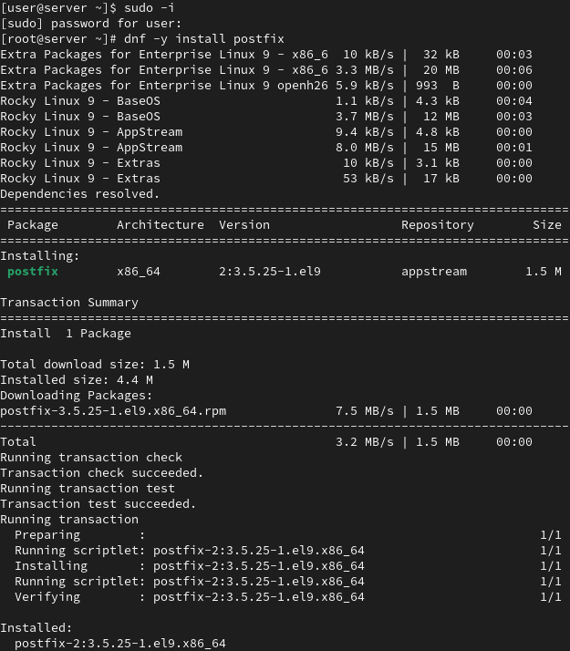{#fig:001 width=70%}

И s-nail (рис. [-@fig:002]).

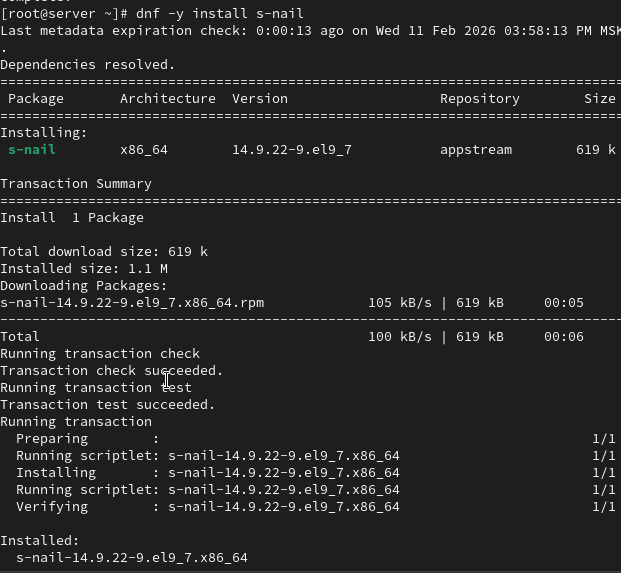{#fig:002 width=70%}

Разрешаю работу с smpt путём коррекции настроек межсетевого экрана (рис. [-@fig:003]).

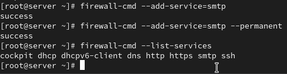{#fig:003 width=70%}

Восстанавливаю контекст безопасности и запускаю postfix (рис. [-@fig:004]).

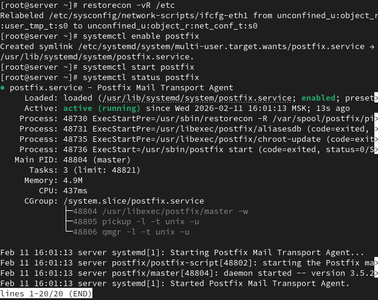{#fig:004 width=70%}

## Изменение параметров Postfix с помощью postconf

Просматриваю список текущих настроек postfix (рис. [-@fig:005]).

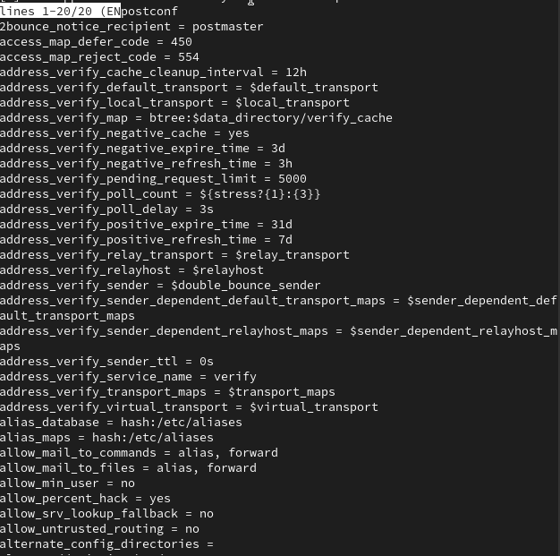{#fig:005 width=70%}

Просматриваю текущие значения параметров myorigin и mydomain (рис. [-@fig:006]).

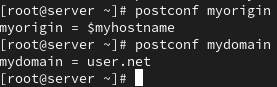{#fig:006 width=70%}

Затем меняю значение параметра myorigin (рис. [-@fig:007]).

{#fig:007 width=70%}

Проверяю конфиг на ошибки, перезагружаю postfix и смотрю все значения, которые установлены на значения, отличные от базовых. Конечно же вижу там наши параметры, которые мы и меняли (рис. [-@fig:008]).

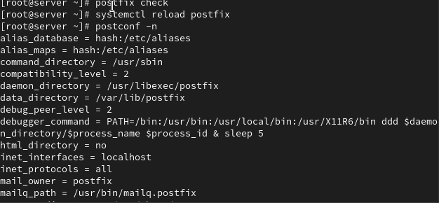{#fig:008 width=70%}

Затем устанавливаю жёсткое значение для mydomain, отключаю ipv6, проверяю корректность правок и перезагружаю postfix (рис. [-@fig:009]).

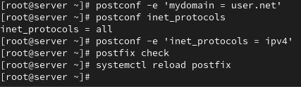{#fig:009 width=70%}

## Проверка работы Postfix

Из под пользователя отправляю себе письмо и по логу вижу, что оно было доставлено (delivered to mailbox) (рис. [-@fig:010]).

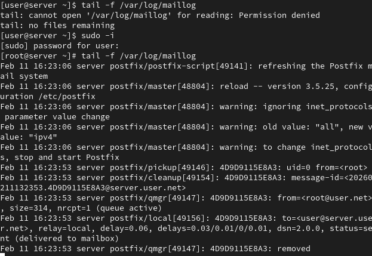{#fig:010 width=70%}

В каталоге /var/spool/mail открываю файл user и вижу там только что отправленное письмо(рис. [-@fig:011]).

{#fig:011 width=70%}

На виртуальной машине устанавливаю те же пакеты (рис. [-@fig:012]), (рис. [-@fig:013]).

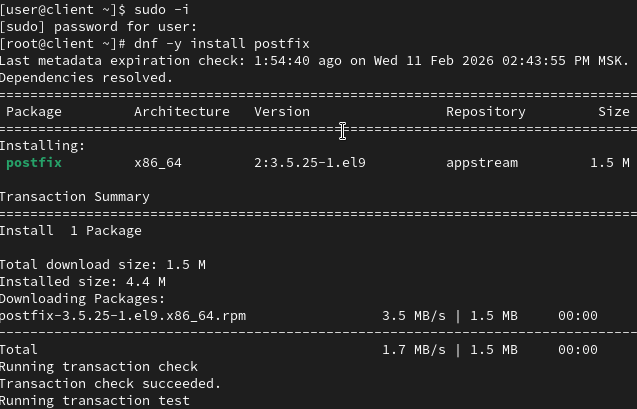{#fig:012 width=70%}

{#fig:013 width=70%}

Тут тоже отключаю ipv6 и запускаю postfix(рис. [-@fig:014]).

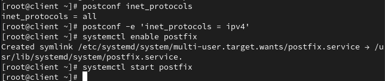{#fig:014 width=70%}

Отправляю письмо с клиента на сервер server.user.net и оно туда не доставляется (рис. [-@fig:015]).

{#fig:015 width=70%}

Затем на server смотрю значения сетевых интерфейсов и сетевых адресов и меняю их так, чтобы прослушивались все узлы и добавляю адреса для пересылки сообщений между узлами сети (рис. [-@fig:016]).

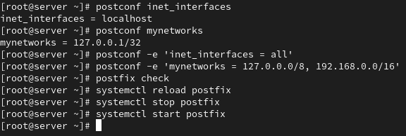{#fig:016 width=70%}

Затем снова отправляю письмо с клиента и в этот раз вижу, что оно ушло, но ушло оно на клиент (рис. [-@fig:017]).

{#fig:017 width=70%}

Но, увы, в самом письме мы видим, что адрес не был найден, поэтому на него ничего не ушло (рис. [-@fig:018]). По логу мы видим тоже самое (рис. [-@fig:019]). На самом деле оно и должно было прити на клиент, но после пресылки с сервера.

{#fig:018 width=70%}

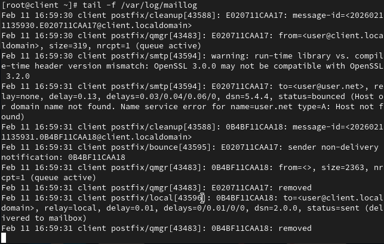{#fig:019 width=70%}

## Конфигурация Postfix для домена

Отправляю письмо на домен user.net (рис. [-@fig:020]).

{#fig:020 width=70%}

Письмо вернулось на клиент, т.к. домен не был найден (рис. [-@fig:021]).

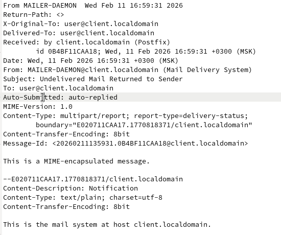{#fig:021 width=70%}

Понятное дело, никакие сообщения не ожидают отправки (рис. [-@fig:022]).

{#fig:022 width=70%}

Добавляю MX и А запись в файл прямой зоны (рис. [-@fig:023]).

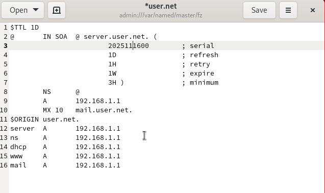{#fig:023 width=70%}

В файл обратной добавляю MX и ptr запись (рис. [-@fig:024]).

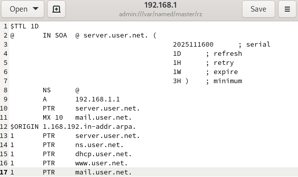{#fig:024 width=70%}

Добавляю домен в список элементов сети, для которых данный сервер является конечной точкой, перезагружаю конфиг postfix, восстанавливаю контекст безопасности и перезапускаю dns-сервер (рис. [-@fig:025]).

{#fig:025 width=70%}

Т.к. и до этих изменений не было сообщений, ожидающих отправки, то и после этих изменений мне нечего отправлять.

## Внесение изменений в настройки внутреннего окружения виртуальной машины

Копирую конфиги postfix и обновляю конфиги dns в настройках внутреннего окружения (рис. [-@fig:026]).

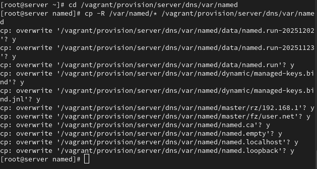{#fig:026 width=70%}

Затем прописываю два скрипта для server и client с одним названием -- mail.sh. Одни повторяет действия по установке и настройки smpt-сервера на сервере (рис. [-@fig:027]). Другой -- на клиенте (рис. [-@fig:028]).

{#fig:027 width=70%}

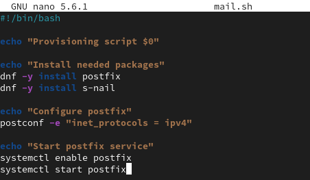{#fig:028 width=70%}

Для отработки обоих этих скриптов при запуске машин server и client добавляю записи в Vagrantfile. Это для server (рис. [-@fig:029]). А это для client (рис. [-@fig:030]).

{#fig:029 width=70%}

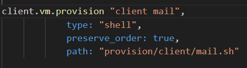{#fig:030 width=70%}

# Выводы

В процессе выполнения данной лабораторной я приобрел практические навыки по установке и конфигурированию SMTP-сервера.

# Список литературы{.unnumbered}

[Администрирование сетевых подсисем](https://esystem.rudn.ru/pluginfile.php/2854557/mod_resource/content/8/008-smtp.pdf)
