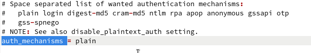
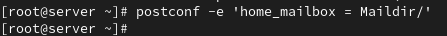
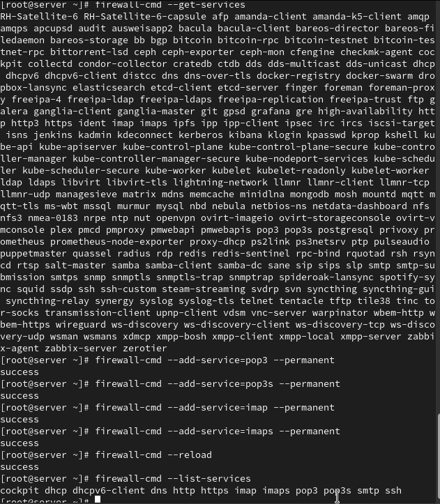
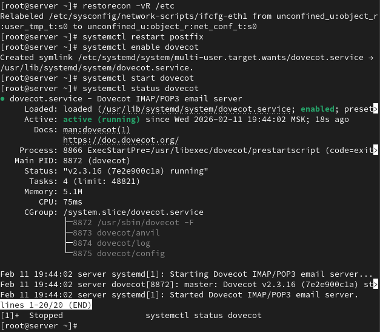
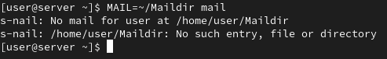
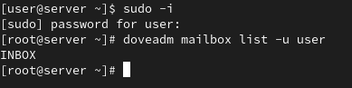
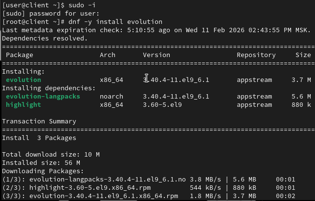
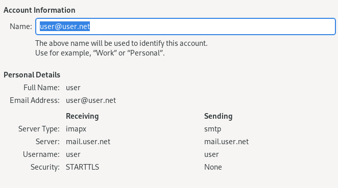
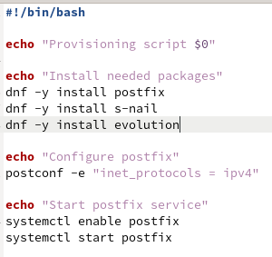

---
## Front matter
title: "Лабораторная работа №9"
subtitle: "Администрирование сетевых подсистем"
author: "Машков Илья Евгеньевич"

## Generic otions
lang: ru-RU
toc-title: "Содержание"

## Bibliography
bibliography: bib/cite.bib
csl: pandoc/csl/gost-r-7-0-5-2008-numeric.csl

## Pdf output format
toc: true # Table of contents
toc-depth: 2
lof: true # List of figures
lot: true # List of tables
fontsize: 12pt
linestretch: 1.5
papersize: a4
documentclass: scrreprt
## I18n polyglossia
polyglossia-lang:
  name: russian
  options:
	- spelling=modern
	- babelshorthands=true
polyglossia-otherlangs:
  name: english
## I18n babel
babel-lang: russian
babel-otherlangs: english
## Fonts
mainfont: PT Serif
romanfont: PT Serif
sansfont: PT Sans
monofont: PT Mono
mainfontoptions: Ligatures=TeX
romanfontoptions: Ligatures=TeX
sansfontoptions: Ligatures=TeX,Scale=MatchLowercase
monofontoptions: Scale=MatchLowercase,Scale=0.9
## Biblatex
biblatex: true
biblio-style: "gost-numeric"
biblatexoptions:
  - parentracker=true
  - backend=biber
  - hyperref=auto
  - language=auto
  - autolang=other*
  - citestyle=gost-numeric
## Pandoc-crossref LaTeX customization
figureTitle: "Рис."
tableTitle: "Таблица"
listingTitle: "Листинг"
lofTitle: "Список иллюстраций"
lotTitle: "Список таблиц"
lolTitle: "Листинги"
## Misc options
indent: true
header-includes:
  - \usepackage{indentfirst}
  - \usepackage{float} # keep figures where there are in the text
  - \floatplacement{figure}{H} # keep figures where there are in the text
---

# Цель работы

Приобретение практических навыков по установке и простейшему конфигурированию POP3/IMAP-сервера.

# Задание

1. Установите на виртуальной машине server Dovecot и Telnet для дальнейшей проверки корректности работы почтового сервера.
2. Настройте Dovecot.
3. Установите на виртуальной машине client программу для чтения почты Evolution и настройте её для манипуляций с почтой вашего пользователя. Проверьте корректность работы почтового сервера как с виртуальной машины server, так и с виртуальной машины client.
4. Измените скрипт для Vagrant, фиксирующий действия по установке и настройке Postfix и Dovecote во внутреннем окружении виртуальной машины server, создайте скрипт для Vagrant, фиксирующий действия по установке Evolution во внутреннем окружении виртуальной машины client. Соответствующим образом внесите изменения в Vagrantfile.

# Выполнение лабораторной работы

## Установка Dovecot

Устанавливаю необходимые пакеты (рис. [-@fig:001]).

{#fig:001 width=70%}

## Настройка dovecot

В конфигурационном файле dovecot.conf прописываю список почтовых протоколов (рис. [-@fig:002]).

{#fig:002 width=70%}

Затем в файле 10-auth.conf проверяю, что там установлен метод аутентификации plain (рис. [-@fig:003]).

{#fig:003 width=70%}

Также в auth-system.conf.ext проверяю, что для поиска пользователей и их паролей установлены методы pam и passwd соответственно (рис. [-@fig:004]), (рис. [-@fig:005]).

{#fig:004 width=70%}

{#fig:005 width=70%}

Затем в 10-mail.conf настраиваю местоположение почтовых ящиков пользователей (рис. [-@fig:006]).

{#fig:006 width=70%}

В postfix задаю каталог для хранения почты (рис. [-@fig:007]).

{#fig:007 width=70%}

Затем разрешаю работу с протоколами pop3 и imap путём коррекции настроек сетевого экрана (рис. [-@fig:008]).

{#fig:008 width=70%}

Восстанавливаю контекст безопасности, перезапускаю postfix и запускаю dovecot (рис. [-@fig:009]).

{#fig:009 width=70%}

## Проверка работы Dovecot

Затем использую команду `MAIL=~/Maildir mail` и получаю ответ, где сказано, что нет писем (рис. [-@fig:010]).

{#fig:010 width=70%}

Теперь делаю тоже самое но уже через root-пользователя (рис. [-@fig:011]).

{#fig:011 width=70%}

Перехожу на client и устанавливаю почтовый клиент (рис. [-@fig:012]).

{#fig:012 width=70%}

Произвожу пероначальную настройку, по следующим требованиям:
 
- в окне настройки учётной записи почты укажите имя, адрес почты в виде user@user.net (вместо user укажите свой логин), введите пароль вашего пользователя, нажмите «Продолжить», затем нажмите «Настроить вручную»;
- в качестве IMAP-сервера для входящих сообщений и SMTP-сервера для исходящих сообщений пропишите mail.user.net, в качестве пользователя для входящих и исходящих сообщений укажите user;
- проверьте номера портов: для IMAP — порт 143, для SMTP — порт 25;
- проверьте настройки SSL и метода аутентификации: для IMAP — STARTTLS, аутентификация по обычному паролю, для SMTP — без аутентификации, аутентификация — «Без аутентификации»;
- при возникновении сообщения о небезопасном соединении выставьте галочку о понимании риска работы по такому соединению и нажмите «Ок», затем подтвердите исключение безопасности, нажав в появившемся окне соответствующую кнопку. (рис. [-@fig:013]).

{#fig:013 width=70%}

А тут уже требуется пояснение. Значит, корень проблемы в том, что user.net не существует, хоть я и создавал всё по инструкции, поэтому корень уже этой проблемы может находиться настолько глубоко, что мне придётся переустанавливать обе машины для решения этого вопроса (рис. [-@fig:014]).

{#fig:014 width=70%}

## Внесение изменений в настройки внутреннего окружения виртуальной машины

На машине server закидываю копии всех конфиговских файлов dovecot в каталог, созданный во внутренних настройках окружения (Скрина нет).

Затем редактирую mail.sh на сервере, добавляя туда установку dovecot и telnet, доп. настройку межсетевого экрана, настройку postfix для местоположения почтового ящика и строки отвечающие за перезапуск postfix и запуск dovecot (рис. [-@fig:015]).

{#fig:015 width=70%}

В mail.sh для клиента вношу строку, отвечающую за установку почтового клиента (рис. [-@fig:016]).

{#fig:016 width=70%}

# Выводы

Во время выполнения этой лабы я приобрёл практические навыки по установке и простейшему конфигурированию POP3/IMAP-сервера.

# Список литературы{.unnumbered}

[Администрирование сетевых подсисем](https://esystem.rudn.ru/pluginfile.php/2854561/mod_resource/content/6/009-imap.pdf)
