---
## Front matter
title: "Лабораторная работа №10"
subtitle: "Администрирование сетевых подсистем"
author: "Машков Илья Евгеньевич"

## Generic otions
lang: ru-RU
toc-title: "Содержание"

## Bibliography
bibliography: bib/cite.bib
csl: pandoc/csl/gost-r-7-0-5-2008-numeric.csl

## Pdf output format
toc: true # Table of contents
toc-depth: 2
lof: true # List of figures
lot: true # List of tables
fontsize: 12pt
linestretch: 1.5
papersize: a4
documentclass: scrreprt
## I18n polyglossia
polyglossia-lang:
  name: russian
  options:
	- spelling=modern
	- babelshorthands=true
polyglossia-otherlangs:
  name: english
## I18n babel
babel-lang: russian
babel-otherlangs: english
## Fonts
mainfont: PT Serif
romanfont: PT Serif
sansfont: PT Sans
monofont: PT Mono
mainfontoptions: Ligatures=TeX
romanfontoptions: Ligatures=TeX
sansfontoptions: Ligatures=TeX,Scale=MatchLowercase
monofontoptions: Scale=MatchLowercase,Scale=0.9
## Biblatex
biblatex: true
biblio-style: "gost-numeric"
biblatexoptions:
  - parentracker=true
  - backend=biber
  - hyperref=auto
  - language=auto
  - autolang=other*
  - citestyle=gost-numeric
## Pandoc-crossref LaTeX customization
figureTitle: "Рис."
tableTitle: "Таблица"
listingTitle: "Листинг"
lofTitle: "Список иллюстраций"
lotTitle: "Список таблиц"
lolTitle: "Листинги"
## Misc options
indent: true
header-includes:
  - \usepackage{indentfirst}
  - \usepackage{float} # keep figures where there are in the text
  - \floatplacement{figure}{H} # keep figures where there are in the text
---

# Цель работы

Приобретение практических навыков по конфигурированию SMTP-сервера в части настройки аутентификации.

# Задание

1. Настройте Dovecot для работы с LMTP.
2. Настройте аутентификацию посредством SASL на SMTP-сервере.
3. Настройте работу SMTP-сервера поверх TLS.
4. Скорректируйте скрипт для Vagrant, фиксирующий действия расширенной настройки SMTP-сервера во внутреннем окружении виртуальной машины server.

# Выполнение лабораторной работы

## Настройка LMTP в Dovecote

На сервере перехожу в режим root, на дополнительном терминале запускаю лог почтового ящика, затем в файле dovecot.conf вношу строку, позволяющую работать с протоколом LMTP (рис. [-@fig:001]).

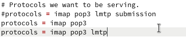{#fig:001 width=70%}

Затем в файле 10-master.conf заменяю определение сервиса lmtp (рис. [-@fig:002]).

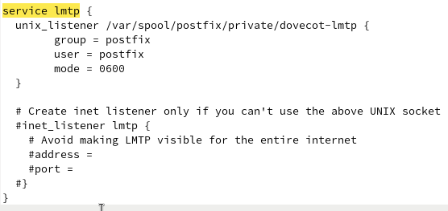{#fig:002 width=70%}

Переопределяю postfix так, чтобы он передавал сообщения не на прямую, а через заданный unix-сокет (рис. [-@fig:003]).

{#fig:003 width=70%}

В файле 10-auth.conf задаю формат имени пользователя для аунтентификации в форме логина пользователя без указания домена (рис. [-@fig:004]).

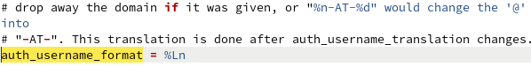{#fig:004 width=70%}

Теперь запускаю клиент и произвожу попытку отправки письма на домен user.net, но, как я уже говорил в прошлых лабораторных такого домена, по некоторым причинам не существует (рис. [-@fig:005]).

{#fig:005 width=70%}

В логах вижу, что сообщение, ожидаемо, не ушло и было возвращено на cliet(рис. [-@fig:006]).

{#fig:006 width=70%}

## Настройка SMTP-аутентификации

В файле 10-master.conf определяю службу аунтентификации пользователей (На скрине есть небольшая опечатка: должно быть dovecot, а не doveco) (рис. [-@fig:007]).

{#fig:007 width=70%}

Задаю postfix тип аутентификации SASL для smtpd и путь к соответствующему unix-сокету (рис. [-@fig:008]).

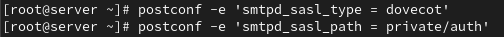{#fig:008 width=70%}

Настраиваю Postfix для приёма почты из Интернета только для обслуживаемых нашим сервером пользователей или для произвольных пользователей локальной машины (имеется в виду локальных пользователей сервера), обеспечивая тем самым запрет на использование почтового сервера в качестве SMTP relay для спам-рассылок (рис. [-@fig:009]).

{#fig:009 width=70%}

Затем ограничиваю приём почты только локаьным адресом smtp-сервера сети, а потом вношу изменения в master.cf (рис. [-@fig:010]).

{#fig:010 width=70%}

Перезапускаю postfix и dovecot(рис. [-@fig:011]).

{#fig:011 width=70%}

На клиенте устанавливаю telnet (рис. [-@fig:012]).

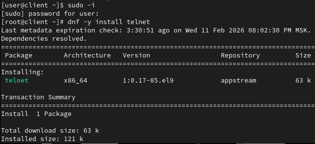{#fig:012 width=70%}

Получаю строку аунтентификации, введя имя пользователя и пароль. Потом совершаю неудачную попытку отправки письма (рис. [-@fig:013]).

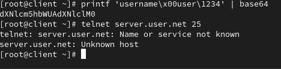{#fig:013 width=70%}

## Настройка SMTP over TLS

Копирую файлы сертификата в другую директорию, чтобы не иметь проблем с SELinux(рис. [-@fig:014]).

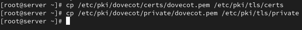{#fig:014 width=70%}

Конфигурирую Postfix, указав пути к сертификату и ключу, а также к каталогу для хранения TLS-сессий и уровень безопасности (рис. [-@fig:015]).

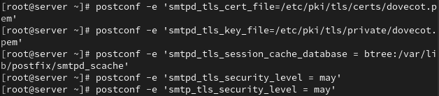{#fig:015 width=70%}

Для того чтобы запустить SMTP-сервер на 587-м порту, в файле /etc/postfix/master.cf заменяю строки на следующее (рис. [-@fig:016]).

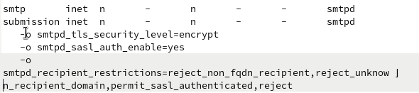{#fig:016 width=70%}

Настраиваю межсетевой экран, тем самым разрешив работу службе smpt-submission (рис. [-@fig:017]).

{#fig:017 width=70%}

Следующие действия я не скринил, т.к. все они потерпели неудачу из-за проблемы, которая тянется за мной со второй лабы.

## Внесение изменений в настройки внутреннего окружения виртуальной машины

Копирую конфиговские файлы dovecot и postfix в настройки внутреннего окружения (рис. [-@fig:018]).

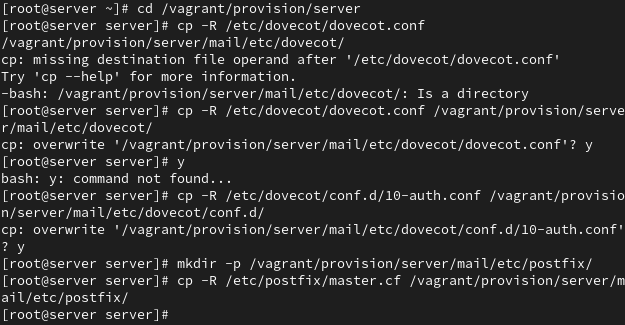{#fig:018 width=70%}

Изменяю mail.sh на сервере, добавляя расширенную конфигурацию smpt-сервера (рис. [-@fig:019]).

{#fig:019 width=70%}

Изменяю mail.sh на клиенте, добавляя установку telnet (рис. [-@fig:020]).

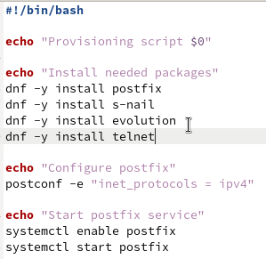{#fig:020 width=70%}

# Выводы

Во время выполнения этой лабораторной работы я приобрёл практические навыки по конфигурированию SMTP-сервера в части настройки аутентификации.

# Список литературы{.unnumbered}

[Администрирование сетевых подсисем](https://esystem.rudn.ru/pluginfile.php/2854573/mod_resource/content/6/010-smtp-adv.pdf)
