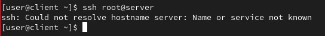
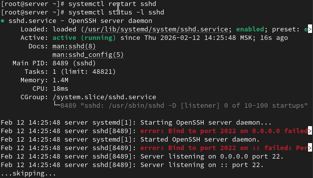
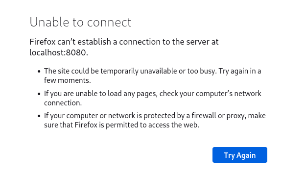
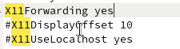

---
## Front matter
title: "Лабораторная работа №11"
subtitle: "Администрирование сетевых подсистем"
author: "Машков Илья Евгеньевич"

## Generic otions
lang: ru-RU
toc-title: "Содержание"

## Bibliography
bibliography: bib/cite.bib
csl: pandoc/csl/gost-r-7-0-5-2008-numeric.csl

## Pdf output format
toc: true # Table of contents
toc-depth: 2
lof: true # List of figures
lot: true # List of tables
fontsize: 12pt
linestretch: 1.5
papersize: a4
documentclass: scrreprt
## I18n polyglossia
polyglossia-lang:
  name: russian
  options:
	- spelling=modern
	- babelshorthands=true
polyglossia-otherlangs:
  name: english
## I18n babel
babel-lang: russian
babel-otherlangs: english
## Fonts
mainfont: PT Serif
romanfont: PT Serif
sansfont: PT Sans
monofont: PT Mono
mainfontoptions: Ligatures=TeX
romanfontoptions: Ligatures=TeX
sansfontoptions: Ligatures=TeX,Scale=MatchLowercase
monofontoptions: Scale=MatchLowercase,Scale=0.9
## Biblatex
biblatex: true
biblio-style: "gost-numeric"
biblatexoptions:
  - parentracker=true
  - backend=biber
  - hyperref=auto
  - language=auto
  - autolang=other*
  - citestyle=gost-numeric
## Pandoc-crossref LaTeX customization
figureTitle: "Рис."
tableTitle: "Таблица"
listingTitle: "Листинг"
lofTitle: "Список иллюстраций"
lotTitle: "Список таблиц"
lolTitle: "Листинги"
## Misc options
indent: true
header-includes:
  - \usepackage{indentfirst}
  - \usepackage{float} # keep figures where there are in the text
  - \floatplacement{figure}{H} # keep figures where there are in the text
---

# Цель работы

Приобретение практических навыков по настройке удалённого доступа к серверу с помощью SSH.

# Задание

1. Настройте запрет удалённого доступа на сервер по SSH для пользователя root.
2. Настройте разрешение удалённого доступа к серверу по SSH только для пользователей группы vagrant и вашего пользователя.
3. Настройте удалённый доступ к серверу по SSH через порт 2022.
4. Настройте удалённый доступ к серверу по SSH по ключу.
5. Организуйте SSH-туннель с клиента на сервер, перенаправив локальное соединение с TCP-порта 80 на порт 8080.
6. Используя удалённое SSH-соединение, выполните с клиента несколько команд на сервере.
7. Используя удалённое SSH-соединение, запустите с клиента графическое приложение на сервере.
8. Напишите скрипт для Vagrant, фиксирующий действия по настройке SSH-сервера во внутреннем окружении виртуальной машины server. Соответствующим образом внесите изменения в Vagrantfile.

# Выполнение лабораторной работы

## Запрет удалённого доступа по SSH для пользователя root

Запускаю лог системных событий на сервере, а затем перехожу на клиент и пытаюсь получить доступ к серверу посредством ssh, но данная попытка терпит не удачу, т.к. client и server между собой никак не связаны (рис. [-@fig:001]).

{#fig:001 width=70%}

В файле sshd_config запрещаю вход на сервер пользователю root (рис. [-@fig:002]).

{#fig:002 width=70%}

Перезапускаю службу sshd (рис. [-@fig:003]).

{#fig:003 width=70%}

Снова пытаюсь получить доступ к серверу, но, увы, неудачно (рис. [-@fig:004]).

{#fig:004 width=70%}

## Ограничение списка пользователей для удалённого доступа по SSH

Снова открываю файл sshd_config и добавляю строку, показанную на скрине, а потом перезагружаю sshd (рис. [-@fig:005]). Ожидаемо, что повторная отправка тоже закончилась неудачей.

{#fig:005 width=70%}

Снова редактирую sshd_config, добавляя к ранее внесённой строке имя пользователя (рис. [-@fig:006]).

{#fig:006 width=70%}

## Настройка дополнительных портов для удалённого доступа по SSH

В файл sshd_config добавляю строки, позволяющие организовать весь процесс через два порта (рис. [-@fig:007]).

{#fig:007 width=70%}

Перезапускаю службу sshd и просматриваю её статус. Вижу, что организацию через порт 2022 не получилось сделать (рис. [-@fig:008]).

{#fig:008 width=70%}

Смотрю логи и замечаю, что в доступе было отказано из-за службы SELinux (рис. [-@fig:009]).

{#fig:009 width=70%}

Исправляю метки SELinux относительно порта 2022, перенастраиваю межсетевой экран на работу с TCP-портом 2022, перезапускаю службу и просматриваю статус. В этот раз всё исправно (рис. [-@fig:010]).

{#fig:010 width=70%}

## Настройка удалённого доступа по SSH по ключу

В файле sshd_config добавляю строку, показанную на скрине (рис. [-@fig:011]).

{#fig:011 width=70%}

Генерирую ssh-ключ (рис. [-@fig:012]).

{#fig:012 width=70%}

Отправка ключа и обращение к серверу окончились ничем (рис. [-@fig:013]).

{#fig:013 width=70%}

## Организация туннелей SSH, перенаправление TCP-портов

На клиенте просматриваю активные службы с протоколом TCP (рис. [-@fig:014]).

{#fig:014 width=70%}

Перенаправляю 80-ый порт на сервер server.user.net на порт 8080 на локальной машине (рис. [-@fig:015]).

{#fig:015 width=70%}

Затем просматриваю список служб с тем же протоколом, но, т.к. нет связи клиента с сервером, ничего не поменялось. Потом перехожу на адрес localhost:8080 и вижу, что к такому адресу я обратиться не могу по вышеобозначенной причине (рис. [-@fig:016]).

{#fig:016 width=70%}

## Запуск графических приложений через SSH (X11Forwarding)

В файле sshd_config разрешаю отображать на локальном клиентском компьютере графические интерфейсы X11 (рис. [-@fig:017]).

{#fig:017 width=70%}

## Внесение изменений в настройки внутреннего окружения виртуальной машины

Копирую все задействованые в этой лабе конфигурационные файлы в файлы внутреннего окружения машины server. Создаю файл sshd.sh, который будет повторять все ключевые моменты из этой лабы при запуске системы (рис. [-@fig:018]).

{#fig:018 width=70%}

Для отработки скрипта добавляю соответствующую запись в Vagrantfile (рис. [-@fig:019]).

{#fig:019 width=70%}

# Выводы

В процессе выполнения данной лабораторной работы я приобрёл практические навыки по настройке удалённого доступа к серверу с помощью SSH.

# Список литературы{.unnumbered}

[Администрирование сетевых подсисем](https://esystem.rudn.ru/pluginfile.php/2854588/mod_resource/content/6/011-ssh.pdf)
