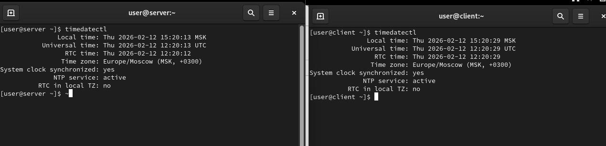
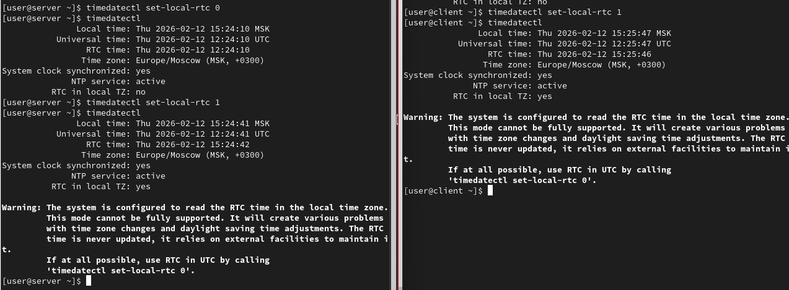
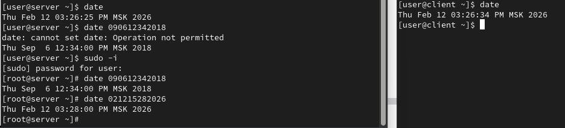
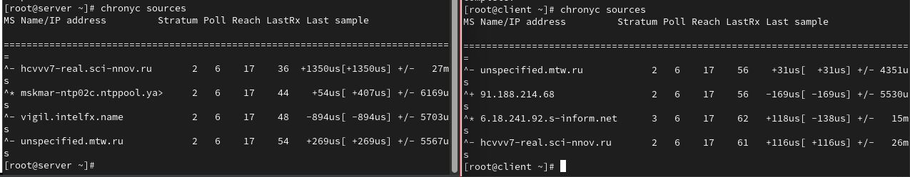
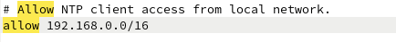
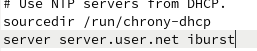
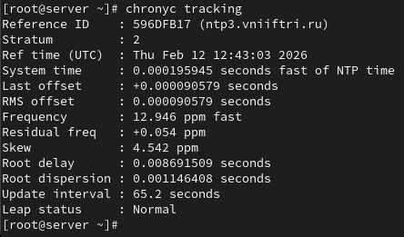
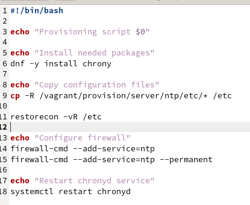
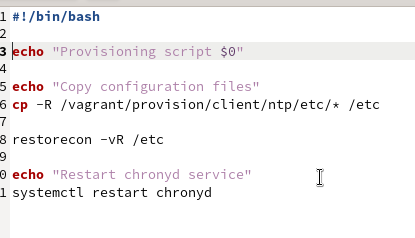
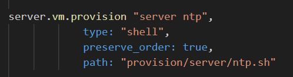

---
## Front matter
title: "Лабораторная работа №12"
subtitle: "Администрирование сетевых подсистем"
author: "Машков Илья Евгеньевич"

## Generic otions
lang: ru-RU
toc-title: "Содержание"

## Bibliography
bibliography: bib/cite.bib
csl: pandoc/csl/gost-r-7-0-5-2008-numeric.csl

## Pdf output format
toc: true # Table of contents
toc-depth: 2
lof: true # List of figures
lot: true # List of tables
fontsize: 12pt
linestretch: 1.5
papersize: a4
documentclass: scrreprt
## I18n polyglossia
polyglossia-lang:
  name: russian
  options:
	- spelling=modern
	- babelshorthands=true
polyglossia-otherlangs:
  name: english
## I18n babel
babel-lang: russian
babel-otherlangs: english
## Fonts
mainfont: PT Serif
romanfont: PT Serif
sansfont: PT Sans
monofont: PT Mono
mainfontoptions: Ligatures=TeX
romanfontoptions: Ligatures=TeX
sansfontoptions: Ligatures=TeX,Scale=MatchLowercase
monofontoptions: Scale=MatchLowercase,Scale=0.9
## Biblatex
biblatex: true
biblio-style: "gost-numeric"
biblatexoptions:
  - parentracker=true
  - backend=biber
  - hyperref=auto
  - language=auto
  - autolang=other*
  - citestyle=gost-numeric
## Pandoc-crossref LaTeX customization
figureTitle: "Рис."
tableTitle: "Таблица"
listingTitle: "Листинг"
lofTitle: "Список иллюстраций"
lotTitle: "Список таблиц"
lolTitle: "Листинги"
## Misc options
indent: true
header-includes:
  - \usepackage{indentfirst}
  - \usepackage{float} # keep figures where there are in the text
  - \floatplacement{figure}{H} # keep figures where there are in the text
---

# Цель работы

Получение навыков по управлению системным временем и настройке синхронизации времени.

# Задание

1. Изучите команды по настройке параметров времени.
2. Настройте сервер в качестве сервера синхронизации времени для локальной сети.
3. Напишите скрипты для Vagrant, фиксирующие действия по установке и настройке NTP-сервера и клиента.

# Выполнение лабораторной работы

## Настройка параметров времени

На сервере и на клиенте смотрю настройки даты и времени. Все настройки совпадают и являются верными (рис. [-@fig:001]).

{#fig:001 width=70%}

Затем экспериментирую с параметрами этой команды и устанавливаю аппаратные часы в соответствии с системным временем (UTC) (рис. [-@fig:002]).

{#fig:002 width=70%}

Затем использую команду date и вижу, что все данные и с сервера, и с клиента всё совпадает. Также для эксперимента ставлю дату на сервере на 6-е сентября 2018 года, а время на 00:34 по МСК (рис. [-@fig:003]).

{#fig:003 width=70%}

Просматриваю аппаратное время на сервере и клиенте. Всё совпадает с нынешними значениями ДДММГГ (рис. [-@fig:004]).

{#fig:004 width=70%}

## Управление синхронизацией времени

Устанавливаю программное обеспечение chrony на сервер (рис. [-@fig:005]).

{#fig:005 width=70%}

Вывожу информацию об источниках времени на обоих машинах и получаю список адресов, откуда и берётся информация для настройки времени (рис. [-@fig:006]).

{#fig:006 width=70%}

В файле chrony.conf вношу адрес 192.168.0.0/16 (рис. [-@fig:007]).

{#fig:007 width=70%}

Перезапускаю службу chronyd и настраиваю межсетевой экран на сервере (рис. [-@fig:008]).

{#fig:008 width=70%}

Затем в файле chrony.conf на клиенте добавляю строку, которая предписывает синхронизацию времени с сервером и при возможности ускорить этот процесс путём отправки пакетов (рис. [-@fig:009]).

{#fig:009 width=70%}

Перезапускаю службу и вывожу информацию об источниках времени на клиенте и вижу, что добавились подозрительно знакомые мне адреса, а также подробную информацию о синхронизации. Вижу там ID сервера, с которым и происходит синхронизация (рис. [-@fig:010]).

{#fig:010 width=70%}

На сервере при просмотре информации о синхронизации замечаю, что id сервера отличается от клиента (рис. [-@fig:011]).

{#fig:011 width=70%}

## Внесение изменений в настройки внутреннего окружения виртуальных машин

Вношу конфиговские файлы, скоторыми я работал в каталог внутреннего окружения машины server (рис. [-@fig:012]). Совершаю те же действия на клиенте (рис. [-@fig:013]).

{#fig:012 width=70%}

{#fig:013 width=70%}

Затем на сервере прописываю скрипт ntp.sh, который будет воспроизводить ключевые дейсвия из данной лабораторной при запуске системы (рис. [-@fig:014]). На клиенте прописываю тот же скрипт, но он будет воспроизводить ключевые действия, совершённые на клиенте (рис. [-@fig:015]).

{#fig:014 width=70%}

{#fig:015 width=70%}

Для отработки скрипта прописываю соответствующие строки в Vagrantfile для сервера (рис. [-@fig:016]) и клиента (рис. [-@fig:017]).

{#fig:016 width=70%}

{#fig:017 width=70%}

# Выводы

Во время выполнения лабораторной работы я освоил навыки по управлению системным временем и настройке синхронизации времени.

# Список литературы{.unnumbered}

[Администрирование сетевых подсисем](https://esystem.rudn.ru/pluginfile.php/2854605/mod_resource/content/5/012-ntp.pdf)
