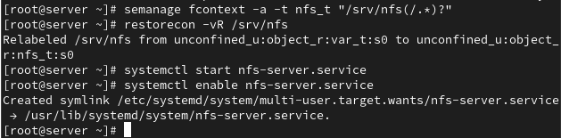
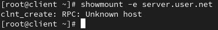
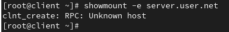
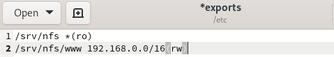
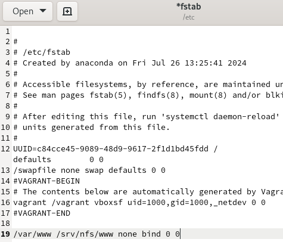
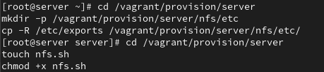
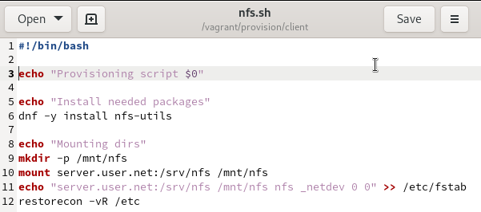

---
## Front matter
title: "Лабораторная работа №13"
subtitle: "Администрирование сетевых подсистем"
author: "Машков Илья Евгеньевич"

## Generic otions
lang: ru-RU
toc-title: "Содержание"

## Bibliography
bibliography: bib/cite.bib
csl: pandoc/csl/gost-r-7-0-5-2008-numeric.csl

## Pdf output format
toc: true # Table of contents
toc-depth: 2
lof: true # List of figures
lot: true # List of tables
fontsize: 12pt
linestretch: 1.5
papersize: a4
documentclass: scrreprt
## I18n polyglossia
polyglossia-lang:
  name: russian
  options:
	- spelling=modern
	- babelshorthands=true
polyglossia-otherlangs:
  name: english
## I18n babel
babel-lang: russian
babel-otherlangs: english
## Fonts
mainfont: PT Serif
romanfont: PT Serif
sansfont: PT Sans
monofont: PT Mono
mainfontoptions: Ligatures=TeX
romanfontoptions: Ligatures=TeX
sansfontoptions: Ligatures=TeX,Scale=MatchLowercase
monofontoptions: Scale=MatchLowercase,Scale=0.9
## Biblatex
biblatex: true
biblio-style: "gost-numeric"
biblatexoptions:
  - parentracker=true
  - backend=biber
  - hyperref=auto
  - language=auto
  - autolang=other*
  - citestyle=gost-numeric
## Pandoc-crossref LaTeX customization
figureTitle: "Рис."
tableTitle: "Таблица"
listingTitle: "Листинг"
lofTitle: "Список иллюстраций"
lotTitle: "Список таблиц"
lolTitle: "Листинги"
## Misc options
indent: true
header-includes:
  - \usepackage{indentfirst}
  - \usepackage{float} # keep figures where there are in the text
  - \floatplacement{figure}{H} # keep figures where there are in the text
---

# Цель работы

Приобретение навыков настройки сервера NFS для удалённого доступа к ресурсам.

# Задание

1. Установите и настройте сервер NFSv4.
2. Подмонтируйте удалённый ресурс на клиенте.
3. Подключите каталог с контентом веб-сервера к дереву NFS.
4. Подключите каталог для удалённой работы вашего пользователя к дереву NFS.
5. Напишите скрипты для Vagrant, фиксирующие действия по установке и настройке сервера NFSv4 во внутреннем окружении виртуальных машин server и client. Соответствующим образом внесите изменения в Vagrantfile.

# Выполнение лабораторной работы

## Настройка сервера NFSv4

Устанавливаю nfs-utils на сервере (рис. [-@fig:001]).

{#fig:001 width=70%}

Создаю каталог, который планируется сделать доступным для всех пользователей сети, а затем в файле exports прописываю подключаемый через NFS общий каталог с доступом только для чтения (рис. [-@fig:002]).

{#fig:002 width=70%}

Задаю контекст безопасноти NFS для нашего каталога, применяю изменённую строку SELinux к файловой системе и запускаю службу NFS (рис. [-@fig:003]).

{#fig:003 width=70%}

Настраиваю межсетевой экран для работы с NFS сервера (рис. [-@fig:004]).

{#fig:004 width=70%}

Перехожу на клиент и устанавливаю те же пакеты, что и на сервер (рис. [-@fig:005]).

{#fig:005 width=70%}

Пробую просмотреть подмонтированные ресурсы, но встречаюсь с той же проблемой, что и в остальных лабораторных - отсутствие связи сервера и клиента (рис. [-@fig:006]).

{#fig:006 width=70%}

Останавливаю сервис межсетевого экрана (рис. [-@fig:007]).

{#fig:007 width=70%}

Пытаюсь подключиться к удалённо смонтированному ресурсо, но, увы, неудачно (рис. [-@fig:008]).

{#fig:008 width=70%}

Запускаю службу межсетевого экрана и просматриваю список служб задействованных при удалённом монтировании, использующих протокл TCP (всё это делаю на сервере) (рис. [-@fig:009]).

{#fig:009 width=70%}

Теперь просматриваю те же службы, но уже использующих UDP-протокол (рис. [-@fig:010]).

{#fig:010 width=70%}

Добавляю службы rpc-bind и mountd в настройки межсетевого экрана на сервере (рис. [-@fig:011]).

{#fig:011 width=70%}

И снова неудачная попытка подключения удалённого ресурса с клиента (рис. [-@fig:012]).

{#fig:012 width=70%}

## Монтирование NFS на клиенте

На клиенте создаю каталог, в который будет монтироваться удалённый ресурс, и подмонтирую дерево NFS, а затем произвожу, опять же, неудачную попытку монтирования (рис. [-@fig:013]).

{#fig:013 width=70%}

## Подключение каталогов к дереву NFS

На сервере создаю общий каталог, в который затем будет подмонтирован каталог с контентом веб-сервера и монтирую каталог этого сервера (рис. [-@fig:014]). На сервере всё было отображено, а на клиенте так ничего и не появилось ничего нет.

{#fig:014 width=70%}

В файле exports добавляю экспорт каталога веб-сервера с удалённого ресурса (рис. [-@fig:015]).

{#fig:015 width=70%}

На клиенте просматриваю каталог NFS и, ожидаемо, ничего не вижу (рис. [-@fig:016]).

{#fig:016 width=70%}

В файле fstab на сервере добавляю следующую запись: (рис. [-@fig:017]).

{#fig:017 width=70%}

## Подключение каталогов для работы пользователей

На сервере под пользователем user в его домашнем каталоге создаю каталог common с полными правами доступа только для этого пользователя, а в нём файл user@server.txt(рис. [-@fig:018]).

{#fig:018 width=70%}

На сервере создаю общий каталог для работы пользователя user по сети и подмонтирую каталог common пользователя user в NFS (рис. [-@fig:019]).

{#fig:019 width=70%}

В файл exports добавляю строки для подключения каталога пользователя (рис. [-@fig:020]).

{#fig:020 width=70%}

Этап работы с клиентом я пропустил, т.к. проблема со связью сервера и клиента никуда не делась 

## Внесение изменений в настройки внутреннего окружения виртуальных машин

На сервере вношу копию файла exports в настройки внутреннего окружения виртуальной машины и создаю скрипт nfs.sh (рис. [-@fig:022]).

{#fig:022 width=70%}

Скрипт nfs.sh повторяет ключевые действия, проделанные на сервере(рис. [-@fig:023]) и клиенте (рис. [-@fig:024]) при запуске каждой виртуальной машины.

{#fig:023 width=70%}

{#fig:024 width=70%}

Для отработки скрипта вношу соответствующие изменения в Vagrantfile для сервера(рис. [-@fig:025]) и клиента (рис. [-@fig:026])..

{#fig:025 width=70%}

{#fig:026 width=70%}

# Выводы

Во время выполнения данной лабораторной работы я освоил практические навыки настройки сервера NFS для удалённого доступа к ресурсам.

# Список литературы{.unnumbered}

[Администрирование сетевых подсисем](https://esystem.rudn.ru/pluginfile.php/2854615/mod_resource/content/5/013-nfs.pdf)
