---
## Front matter
title: "Лабораторная работа №14"
subtitle: "Администрирование сетевых подсистем"
author: "Машков Илья Евгеньевич"

## Generic otions
lang: ru-RU
toc-title: "Содержание"

## Bibliography
bibliography: bib/cite.bib
csl: pandoc/csl/gost-r-7-0-5-2008-numeric.csl

## Pdf output format
toc: true # Table of contents
toc-depth: 2
lof: true # List of figures
lot: true # List of tables
fontsize: 12pt
linestretch: 1.5
papersize: a4
documentclass: scrreprt
## I18n polyglossia
polyglossia-lang:
  name: russian
  options:
	- spelling=modern
	- babelshorthands=true
polyglossia-otherlangs:
  name: english
## I18n babel
babel-lang: russian
babel-otherlangs: english
## Fonts
mainfont: PT Serif
romanfont: PT Serif
sansfont: PT Sans
monofont: PT Mono
mainfontoptions: Ligatures=TeX
romanfontoptions: Ligatures=TeX
sansfontoptions: Ligatures=TeX,Scale=MatchLowercase
monofontoptions: Scale=MatchLowercase,Scale=0.9
## Biblatex
biblatex: true
biblio-style: "gost-numeric"
biblatexoptions:
  - parentracker=true
  - backend=biber
  - hyperref=auto
  - language=auto
  - autolang=other*
  - citestyle=gost-numeric
## Pandoc-crossref LaTeX customization
figureTitle: "Рис."
tableTitle: "Таблица"
listingTitle: "Листинг"
lofTitle: "Список иллюстраций"
lotTitle: "Список таблиц"
lolTitle: "Листинги"
## Misc options
indent: true
header-includes:
  - \usepackage{indentfirst}
  - \usepackage{float} # keep figures where there are in the text
  - \floatplacement{figure}{H} # keep figures where there are in the text
---

# Цель работы

Приобретение навыков настройки доступа групп пользователей к общим ресурсам по протоколу SMB.

# Задание

1. Установите и настройте сервер Samba.
2. Настройте на клиенте доступ к разделяемым ресурсам.
3. Напишите скрипты для Vagrant, фиксирующие действия по установке и настройке сервера Samba для доступа к разделяемым ресурсам во внутреннем окружении виртуальных машин server и client. Соответствующим образом необходимо внести изменения в Vagrantfile.

# Выполнение лабораторной работы

## Настройка сервера Samba

На сервере устанавливаю необходимые пакеты (рис. [-@fig:001]).

{#fig:001 width=70%}

Создаю группу sambagroup для пользователей, которые будут работать с Samba-сервером и присваиваю ей свой GID, добавляю пользователя к этой группе и создаю общий каталог в файловой системе (рис. [-@fig:002]).

{#fig:002 width=70%}

В файле smb.conf меняю название рабочей группы на своё и добавляю описание общего доступа к разделяемого ресурса /srv/sambashare (рис. [-@fig:003]).

{#fig:003 width=70%}

Проверяю файл на ошибки (рис. [-@fig:004]).

{#fig:004 width=70%}

Запускаю Samba и проверяю статус службы. Вижу, что всё отлично (рис. [-@fig:005]).

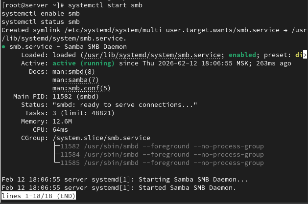{#fig:005 width=70%}

Проверяю наличие общего доступа с помощью smbclient (рис. [-@fig:006]).

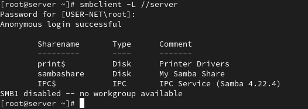{#fig:006 width=70%}

Просматриваю файл конфигурации samba.xml (рис. [-@fig:007]).

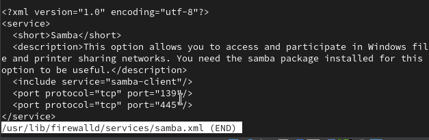{#fig:007 width=70%}

Настраиваю межсетевой экран (рис. [-@fig:008]).

{#fig:008 width=70%}

Настраиваю права доступа для каталога с разделяемым ресурсом (рис. [-@fig:009]).

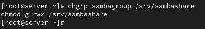{#fig:009 width=70%}

Проверяю, что контекст безопасности изменился (рис. [-@fig:010]).

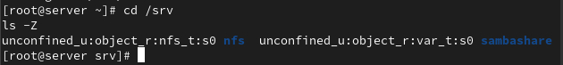{#fig:010 width=70%}

Разрешаю экспортировать разделяемые ресурсы для чтения и записи (рис. [-@fig:011]).

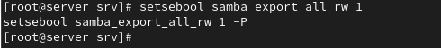{#fig:011 width=70%}

Просматриваю id пользователя и вижу, что gid(1001(user)) и он состоит в группе sambagroup (рис. [-@fig:012]).

{#fig:012 width=70%}

Пытаюсь создать txt-файл на разделяемом ресурсе, но получаю отказ в доступе (рис. [-@fig:013]).

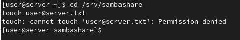{#fig:013 width=70%}

Добавляю пользователя user в базу пользователей Samba и задаю пароль (рис. [-@fig:014]).

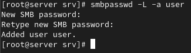{#fig:014 width=70%}

## Монтирование файловой системы Samba на клиенте

Теперь устанавливаю те же пакеты, но уже на клиент (рис. [-@fig:015]).

{#fig:015 width=70%}

Просмотр файла конфигурации samba-client.xml на клиенте (рис. [-@fig:016]).

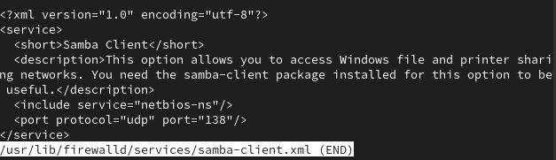{#fig:016 width=70%}

Настраиваю межсетевой экран на клиенте (рис. [-@fig:017]).

{#fig:017 width=70%}

Создаю группу и добавление пользователя в эту группу на клиенте (рис. [-@fig:018]).

{#fig:018 width=70%}

В файле smb.conf изменяю параметр рабочей группы на свой (рис. [-@fig:019]).

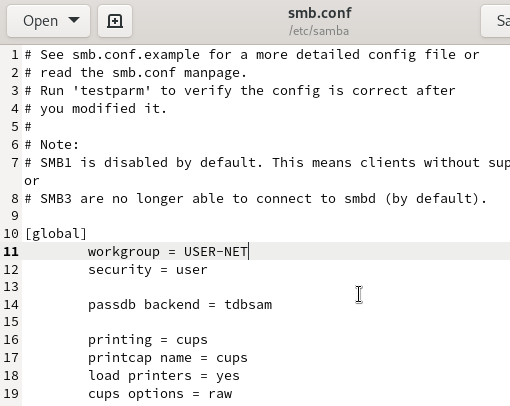{#fig:019 width=70%}

Пробую подключиться к серверу, но этого не происходит (рис. [-@fig:020]).

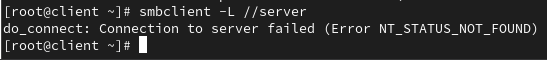{#fig:020 width=70%}

Пробую получить доступ к общему ресурсу с помощью mount, но терплю неудачу (рис. [-@fig:021]).

{#fig:021 width=70%}

Все остальные этапы я намеренно пропустил из-за ранее озвученных причин.

## Внесение изменений в настройки внутреннего окружения виртуальных машин

Вношу копии конфигурационных файлов, которые мы меняли, в файлы с настройками внутреннего окружения машины server (рис. [-@fig:022]).

{#fig:022 width=70%}

Создаю скрипт smb.sh, который будет повторять ключевые действия, совершённые на машине server (рис. [-@fig:023]) и client (рис. [-@fig:024]).

{#fig:023 width=70%}

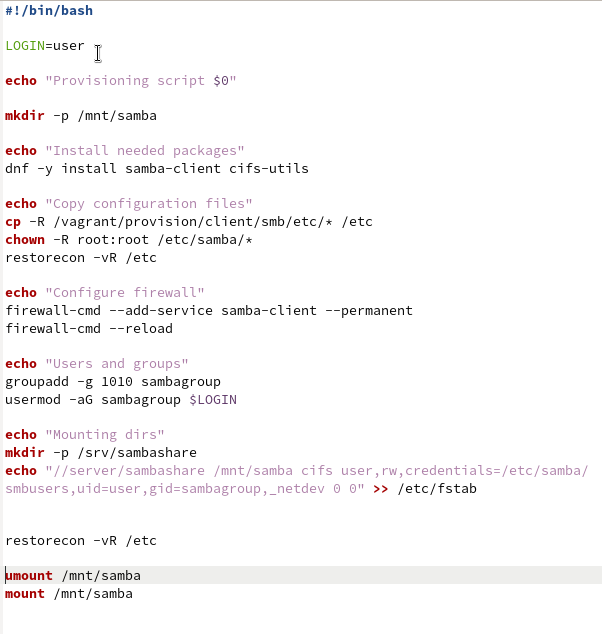{#fig:024 width=70%}

Для отработки скрипта вношу соответствующие изменения Vagrantfile для server (рис. [-@fig:025]) и client (рис. [-@fig:026]).

{#fig:025 width=70%}

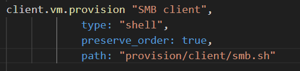{#fig:026 width=70%}

# Выводы

Во время выполнения данной лабораторной работы я освоил навыки настройки доступа групп пользователей к общим ресурсам по протоколу SMB.

# Список литературы{.unnumbered}

[Администрирование сетевых подсисем](https://esystem.rudn.ru/pluginfile.php/2854619/mod_resource/content/7/014-smb.pdf)
