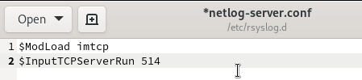
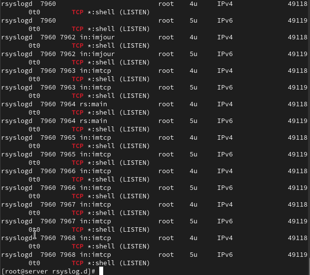
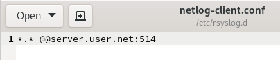
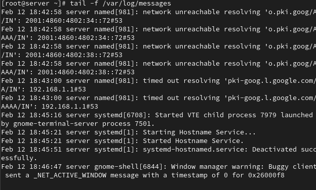
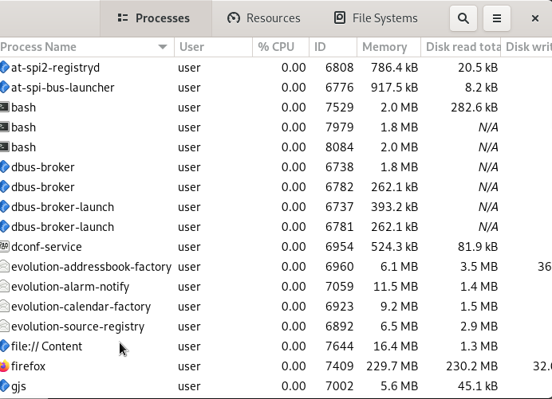
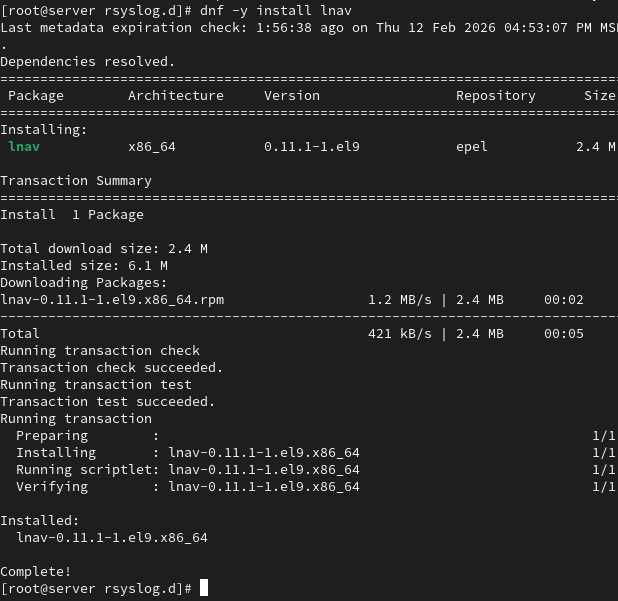
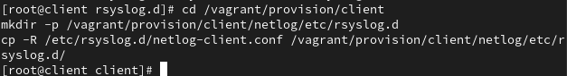
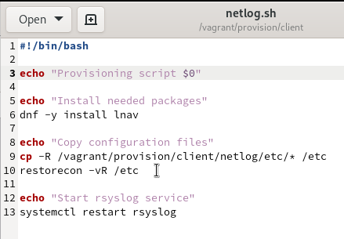
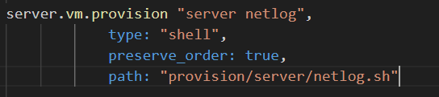

---
## Front matter
title: "Лабораторная работа №15"
subtitle: "Администрирование сетевых подсистем"
author: "Машков Илья Евгеньевич"

## Generic otions
lang: ru-RU
toc-title: "Содержание"

## Bibliography
bibliography: bib/cite.bib
csl: pandoc/csl/gost-r-7-0-5-2008-numeric.csl

## Pdf output format
toc: true # Table of contents
toc-depth: 2
lof: true # List of figures
lot: true # List of tables
fontsize: 12pt
linestretch: 1.5
papersize: a4
documentclass: scrreprt
## I18n polyglossia
polyglossia-lang:
  name: russian
  options:
	- spelling=modern
	- babelshorthands=true
polyglossia-otherlangs:
  name: english
## I18n babel
babel-lang: russian
babel-otherlangs: english
## Fonts
mainfont: PT Serif
romanfont: PT Serif
sansfont: PT Sans
monofont: PT Mono
mainfontoptions: Ligatures=TeX
romanfontoptions: Ligatures=TeX
sansfontoptions: Ligatures=TeX,Scale=MatchLowercase
monofontoptions: Scale=MatchLowercase,Scale=0.9
## Biblatex
biblatex: true
biblio-style: "gost-numeric"
biblatexoptions:
  - parentracker=true
  - backend=biber
  - hyperref=auto
  - language=auto
  - autolang=other*
  - citestyle=gost-numeric
## Pandoc-crossref LaTeX customization
figureTitle: "Рис."
tableTitle: "Таблица"
listingTitle: "Листинг"
lofTitle: "Список иллюстраций"
lotTitle: "Список таблиц"
lolTitle: "Листинги"
## Misc options
indent: true
header-includes:
  - \usepackage{indentfirst}
  - \usepackage{float} # keep figures where there are in the text
  - \floatplacement{figure}{H} # keep figures where there are in the text
---

# Цель работы

Получение навыков по работе с журналами системных событий.

# Задание

1. Настройте сервер сетевого журналирования событий.
2. Настройте клиент для передачи системных сообщений в сетевой журнал на сервере.
3. Просмотрите журналы системных событий с помощью нескольких программ. При наличии сообщений о некорректной работе сервисов исправьте ошибки в настройках соответствующих служб.
4. Напишите скрипты для Vagrant, фиксирующие действия по установке и настройке сетевого сервера журналирования.

# Выполнение лабораторной работы

## Настройка сервера сетевого журнала

На сервере создаю файл конфигурации сетевого журнала. В конфигурационном файле включаю приём записей журнала по TCP-порту 514 (рис. [-@fig:001]).

{#fig:001 width=70%}

Перезапускаю службу rsyslog и смотрю, что прослушиваются нужные нам порты (рис. [-@fig:002]).

{#fig:002 width=70%}

Настраиваю межсетевой экран на работу с приёмом записей по tcp-порту 514 (рис. [-@fig:003]).

{#fig:003 width=70%}

## Настройка клиента сетевого журнала

Создаю файл netlog-client.conf на клиенте и включаю перенаправление сообщений журнала на tcp-порт 514, т.е. на порт сервера (рис. [-@fig:004]). После этого перезагружаю службу rsyslog.

{#fig:004 width=70%}

## Просмотр журнала

Запускаю лог файлов журнала и просматриваю его(рис. [-@fig:005]).

{#fig:005 width=70%}

Запускаю программу для просмотра журналов под пользователем user (рис. [-@fig:006]).

{#fig:006 width=70%}

Устанавливаю lnav на сервер (рис. [-@fig:007]).

{#fig:007 width=70%}

С помощью lnav просматриваю логи (рис. [-@fig:008]).

{#fig:008 width=70%}

## Внесение изменений в настройки внутреннего окружения виртуальных машин

Вношу копии изменённых конфигов в файлы настройки внутреннего окружения машины server(рис. [-@fig:009]) и client (рис. [-@fig:010]).

{#fig:009 width=70%}

{#fig:010 width=70%}

Затем создаю скрипт netlog.sh, который повторяет ключевые действия, совершённые на машине server (рис. [-@fig:011]) и client (рис. [-@fig:012]), при каждом запуске этих систем.

{#fig:011 width=70%}

{#fig:012 width=70%}

Для отработки скрипта вношу соответствующие изменения в Vagrantfile для server (рис. [-@fig:013]) и client (рис. [-@fig:014]).

{#fig:013 width=70%}

{#fig:014 width=70%}

# Выводы

В процессе выполнения данной лабораторной работы я освоил навыки по работе с журналами системных событий.

# Список литературы{.unnumbered}

[Администрирование сетевых подсисем](https://esystem.rudn.ru/pluginfile.php/2854623/mod_resource/content/8/015-netlog.pdf)
