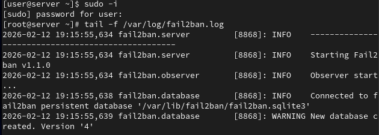
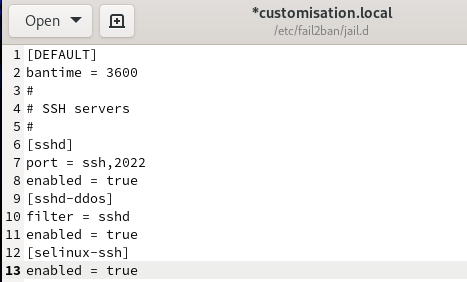
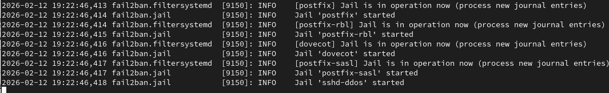
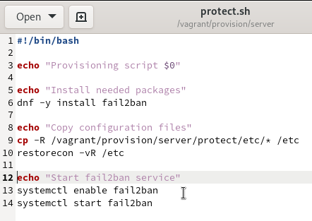
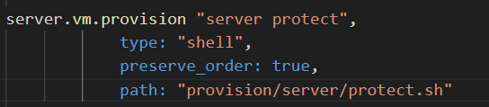

---
## Front matter
title: "Лабораторная работа №16"
subtitle: "Администрирование сетевых подсистем"
author: "Машков Илья Евгеньевич"

## Generic otions
lang: ru-RU
toc-title: "Содержание"

## Bibliography
bibliography: bib/cite.bib
csl: pandoc/csl/gost-r-7-0-5-2008-numeric.csl

## Pdf output format
toc: true # Table of contents
toc-depth: 2
lof: true # List of figures
lot: true # List of tables
fontsize: 12pt
linestretch: 1.5
papersize: a4
documentclass: scrreprt
## I18n polyglossia
polyglossia-lang:
  name: russian
  options:
	- spelling=modern
	- babelshorthands=true
polyglossia-otherlangs:
  name: english
## I18n babel
babel-lang: russian
babel-otherlangs: english
## Fonts
mainfont: PT Serif
romanfont: PT Serif
sansfont: PT Sans
monofont: PT Mono
mainfontoptions: Ligatures=TeX
romanfontoptions: Ligatures=TeX
sansfontoptions: Ligatures=TeX,Scale=MatchLowercase
monofontoptions: Scale=MatchLowercase,Scale=0.9
## Biblatex
biblatex: true
biblio-style: "gost-numeric"
biblatexoptions:
  - parentracker=true
  - backend=biber
  - hyperref=auto
  - language=auto
  - autolang=other*
  - citestyle=gost-numeric
## Pandoc-crossref LaTeX customization
figureTitle: "Рис."
tableTitle: "Таблица"
listingTitle: "Листинг"
lofTitle: "Список иллюстраций"
lotTitle: "Список таблиц"
lolTitle: "Листинги"
## Misc options
indent: true
header-includes:
  - \usepackage{indentfirst}
  - \usepackage{float} # keep figures where there are in the text
  - \floatplacement{figure}{H} # keep figures where there are in the text
---

# Цель работы

Получить навыки работы с программным средством Fail2ban для обеспечения базовой защиты от атак типа «brute force».

# Задание

1. Установите и настройте Fail2ban для отслеживания работы установленных на сервере служб.
2. Проверьте работу Fail2ban посредством попыток несанкционированного доступа с клиента на сервер через SSH.
3. Напишите скрипт для Vagrant, фиксирующий действия по установке и настройке Fail2ban.

# Выполнение лабораторной работы

## Защита с помощью Fail2ban

На сервере устанавливаю fail2ban (рис. [-@fig:001]).

{#fig:001 width=70%}

Запускаю сервер fail2ban (рис. [-@fig:002]).

{#fig:002 width=70%}

В доп. терминале запускаю просмотр журнала событий этой службы (рис. [-@fig:003]).

{#fig:003 width=70%}

Создаю конфигурационный файл с локальной конфигурацией и вношу в него строки, отвечающие за время блокировки(1 час) и защиту SSH (рис. [-@fig:004]).

{#fig:004 width=70%}

Перезапускаю fail2ban и в журнале вижу, что защита shh была активирована (рис. [-@fig:005]).

{#fig:005 width=70%}

Теперь включаю защиту HTTP (рис. [-@fig:006]).

{#fig:006 width=70%}

Перезапускаю fail2ban и в журнале вижу, что произошла удачная активация защиты HTTP (рис. [-@fig:007]).

{#fig:007 width=70%}

В завершение, включаем защиту почты (рис. [-@fig:008]).

{#fig:008 width=70%}

Перезапускаю fail2ban и в журнале вижу, что произошла удачная активация защиты почты (рис. [-@fig:009]).

{#fig:009 width=70%}

## Проверка работы Fail2ban

Проверяю, что все 16 параметров находятся под защитой (рис. [-@fig:010]).

{#fig:010 width=70%}

Просматриваю cтатус защиты sshd (рис. [-@fig:011]).

{#fig:011 width=70%}

Устанавливаю максимальное кол-во ошибок равным 2 (рис. [-@fig:012]).

{#fig:012 width=70%}

Этапы проверки защиты, путём попыток получить доступ к серверу с клиента, я намеренно пропустил из-за тех же проблем, что и до этого у меня наблюдались

## Внесение изменений в настройки внутреннего окружения виртуальных машин

Вношу файл локальной конфигурации в каталог с настройками внутреннего окружения машины server (рис. [-@fig:013]).

{#fig:013 width=70%}

Создаю скрипт protect.sh, который будет повторять ключевые действия, совершённые на машине server за время выполнения лабораторной работы, при запуске сервера (рис. [-@fig:014]).

{#fig:014 width=70%}

Для отработки скрипта добавляю записи для сервера в Vagrantfile (рис. [-@fig:015]).

{#fig:015 width=70%}

# Выводы

В процессе выполнения данной лабораторной работы я освоил навыки работы с программным средством Fail2ban для обеспечения базовой защиты от атак типа «brute force».

# Список литературы{.unnumbered}

[Администрирование сетевых подсисем](https://esystem.rudn.ru/pluginfile.php/2854627/mod_resource/content/6/016-protect.pdf)
